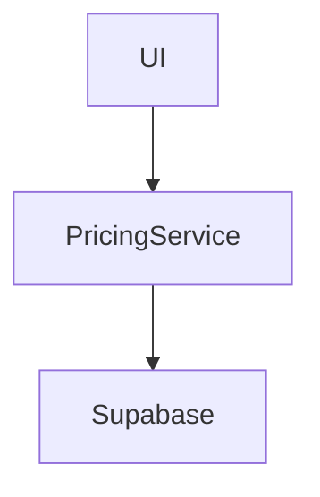

# Architect Specialist Agent Playbook

## Mission
Design, evaluate, refactor, and scale the architecture of **Carolinas Premium**, a Next.js 14+ App Router application (183 files: 44 `.ts`, 137 `.tsx`, 2 `.mjs`) for CRM management. Core domains: clients, finance (`/api/financeiro/categorias`), agenda (`components/agenda`), analytics, AI chat ("Carol" via `/api/carol/query@195`/`actions`), n8n webhooks (`/api/webhook/n8n@42`), notifications (`/api/notifications/send@11`), pricing/services/areas/addons/equipe configs (`app/(admin)/admin/configuracoes/*`), and admin dashboards. Priorities:
- Architect expansions (e.g., analytics dashboards, service scalability).
- Refactor monoliths (e.g., extract CRUD from admin pages to services like `WebhookService` pattern).
- Optimize stack: Supabase (RLS/indexing/pagination), Vercel Edge, caching (`revalidatePath`).
- Audit/enforce: Tech debt (inline fetches in UI), security (webhook secrets), performance (AI queries@224).
- Maintain artifacts: `docs/architecture.md` (Mermaid diagrams), `docs/standards.md` (ADRs), `types/` schemas.

## Responsibilities
- **Enforce Layers**: Utils (pure) → Services (orchestration, 85% confidence pattern) → Controllers (44+ handlers) → UI (RSC/components).
- **Delegate Logic**: Move business ops from controllers/UI to services (e.g., mirror `WebhookService@35` class for pricing/areas).
- **Scalability**: Edge runtimes, Supabase optimizations, React patterns (Server Components, `useTransition`).
- **Documentation**: Update diagrams/schemas, enforce conventions.
- **Audits**: Monolithic admin CRUD, typing (e.g., `PricingConfig@38`), error handling (`{ error: string }`).

## Core Architecture Layers
| Layer | Purpose | Key Directories/Files | Patterns & Conventions |
|-------|---------|-----------------------|------------------------|
| **Utils** | Pure funcs, DB/env access, formatters | `lib/utils.ts`, `lib/business-config.ts` (`parseValue@79`, `formatValue@90`, `mapDbToSettings@95`, `getBusinessSettingsClient@110`, `saveBusinessSettings@125`), `lib/business-config-server.ts` (`getBusinessSettingsServer@8`), `lib/config/webhooks.ts` (`getWebhookUrl@55`, `isWebhookConfigured@69`, `getWebhookSecret@76`, `getWebhookTimeout@94`), `lib/supabase/server.ts`/`client.ts` | Exported funcs only. No side effects. Env-secure (e.g., secrets). Client/server split. |
| **Services** | Business orchestration/classes | `lib/services/webhookService.ts` (`WebhookService@35`), expand for `pricingService.ts`, `configService.ts` | Class-based (ctor deps). Utils/DB orchestration. Exported methods (e.g., n8n payloads, notifications). |
| **Controllers** | API handlers/routing (44 symbols) | `app/api/slots/route.ts` (`GET@4`), `app/api/ready/route.ts` (`GET@6`), `app/api/pricing/route.ts` (`GET@4`), `app/api/health/route.ts` (`GET@9`), `app/api/contact/route.ts` (`POST@4`), `app/api/chat/route.ts` (`POST@16`), `app/api/webhook/n8n/route.ts` (`POST@42`), `app/api/notifications/send/route.ts` (`POST@11`), `app/api/financeiro/categorias/route.ts` (`GET@4`, `POST@31`), `app/api/config/public/route.ts` (`GET@5`), `app/api/carol/query/route.ts` (`queryServicePricing@195`, `queryServiceAreas@224`) | Thin Next.js handlers. Zod/auth → service delegate → typed response (`{ error?: string }`). Add `runtime: 'edge'`. |
| **UI/Components** | Presentation, RSC pages | `components/landing/`, `components/agenda/appointment-form/service-section.tsx` (`ServiceSectionProps@7`), `components/admin/config/pricing-tab.tsx` (`PricingConfig@37`, `fetchPricing@64`, `handleEdit@80`, `handleSave@85`, `toggleActive@117`), `components/admin/config/areas-tab.tsx` (`AreaType@30`, `ZipCodeInput@43`), `app/(admin)/admin/configuracoes/{pricing,servicos,areas,addons,equipe}/page.tsx` (`PricingConfig@38`, `ServiceType@54`, `AreaType@32`, `AddonType@41`), `app/(public)/terms/page.tsx` (`TermsOfServicePage@8`) | RSC-first. Tailwind/shadcn (`cn()`). Mutations via hooks (`useTransition`). Inline types/exported. Paginate lists. |
| **Types/Config** | Schemas/enums | `types/index.ts`, inline in configs (e.g., `BusinessSettings@4`) | Zod-inferred. Exported for reuse (e.g., unify `PricingConfig`, `AreaType`). |

**Data Flow**: Incoming → Controller (validate/auth) → Service (orchestrate) → Utils/Supabase → Response. Server/Client via `-server.ts` suffixed files.

**Tech Stack**:
- Next.js 14+ App Router, Supabase (Auth/DB/RLS), n8n/Carol AI integrations.
- UI: shadcn/Tailwind. Deploy: Vercel (Edge APIs). No tests—add Vitest.

## Key Files and Purposes
### Foundational Utils/Config
| File | Purpose | Key Symbols/Notes |
|------|---------|-------------------|
| `lib/services/webhookService.ts` | n8n webhook orchestration | `WebhookService@35` (class). Extend for new integrations. |
| `lib/business-config.ts` | Client config access/save | `BusinessSettings@4`, `getBusinessSettingsClient@110`, `saveBusinessSettings@125`. |
| `lib/business-config-server.ts` | Server config fetch | `getBusinessSettingsServer@8`. |
| `lib/config/webhooks.ts` | Webhook env helpers | `getWebhookUrl@55`, `isWebhookConfigured@69`, `getWebhookSecret@76`. |
| `app/api/config/public/route.ts` | Public config endpoint | `GET@5`. Cache-heavy. |

### Controllers (High-Traffic)
| File | Purpose | Key Symbols/Notes |
|------|---------|-------------------|
| `app/api/carol/query/route.ts` | AI service/area queries | `queryServicePricing@195`, `queryServiceAreas@224`. Scale with indexing. |
| `app/api/webhook/n8n/route.ts` | n8n ingress | `POST@42`. Secret-validate → `WebhookService`. |
| `app/api/notifications/send/route.ts` | Notification dispatch | `POST@11`. Delegate to service. |
| `app/api/financeiro/categorias/route.ts` | Finance categories CRUD | `GET@4`, `POST@31`. Pagination needed. |

### Admin/UI (Refactor Targets)
| File | Purpose | Key Symbols/Notes |
|------|---------|-------------------|
| `app/(admin)/admin/configuracoes/pricing/page.tsx` | Pricing CRUD | `PricingConfig@38`, `fetchPricing@65`, `handleEdit@81`. Extract to service. |
| `app/(admin)/admin/configuracoes/servicos/page.tsx` | Services CRUD | `ServiceType@54`. |
| `app/(admin)/admin/configuracoes/areas/page.tsx` | Areas CRUD | `AreaType@32`. Zip validation. |
| `app/(admin)/admin/configuracoes/addons/page.tsx` | Addons CRUD | `AddonType@41`. |
| `app/(admin)/admin/configuracoes/equipe/page.tsx` | Team management | Centralize CRUD. |
| `components/admin/config/pricing-tab.tsx` | Pricing tab UI | `handleSave@85`, `toggleActive@117`. Shared patterns. |
| `components/agenda/appointment-form/service-section.tsx` | Appointment services | `ServiceSectionProps@7`. Client-side config use. |

**Repo Focus**: `lib/services/` (expand), `app/(admin)/admin/configuracoes/*` (modularize), `app/api/*` (Edge/validate), `components/admin/config/*` (reuse).

## Best Practices (Derived from Codebase)
- **Services**: Class pattern (`WebhookService`). Ctor inject utils/DB. No direct fetches—delegate. Exported async methods.
- **Controllers**: 1-2 line handlers. Full delegation (e.g., no UI logic). Zod schemas. `{ data, error? }` responses. Add `runtime = 'edge'`.
- **UI/RSC**: Server fetches in pages. Client hooks for optimism (`useTransition`). shadcn primitives. `revalidatePath('/')` post-mutation.
- **Typing**: Export types/enums (e.g., `PricingConfig`). Zod for runtime. `mapDbToSettings@95` for DB<->app mapping.
- **Errors/Security**: Descriptive `Error` throws. `{ error: string }`. RLS enforced, webhook secrets (`getWebhookSecret`).
- **Performance**: `unstable_cache` configs, Supabase `.limit().order()`, Edge for latency. Paginate admin lists.
- **Conventions**: Feature folders (`app/api/{feature}/route.ts`), CamelCase, `.tsx` for UI. No inline styles—Tailwind.
- **Modularity**: Extract repeated handlers (e.g., `handleEdit@80` → service). Env flags for rollouts.

## Specific Workflows and Steps

### 1. New Feature Architecture (e.g., Analytics Dashboard)
1. Gather: `listFiles('lib/services/**')`, `analyzeSymbols('lib/services/webhookService.ts')`, `searchCode('PricingConfig', '**/*.tsx')`.
2. Design types/diagram: Extend `types/config.ts`, Mermaid in `docs/architecture.md`.
3. Implement layers:
   - Utils: `lib/utils/analytics.ts`.
   - Service: `lib/services/analyticsService.ts` (class, e.g., `getMetrics()`).
   - Controller: `app/api/analytics/route.ts` (handlers).
   - UI: `app/(admin)/admin/analytics/page.tsx`, `components/admin/config/analytics-tab.tsx`.
4. Integrate: Update `business-config.ts`.
5. Validate: `tsc --noEmit`, simulate payloads.
6. Doc: ADR in `docs/`, PR checklist.

### 2. Refactor Admin CRUD to Services (e.g., Pricing)
1. Audit: `getFileStructure('app/(admin)/admin/configuracoes/')`, `searchCode('fetchPricing|handleSave', '**/*.tsx')`, `readFile('app/(admin)/admin/configuracoes/pricing/page.tsx')`.
2. Extract: `lib/services/pricingService.ts` (class: `fetchPricing()`, `savePricing()`, `toggleActive()` mirroring `WebhookService`).
3. Migrate UI: Replace inline → service calls.
4. Optimize: Add pagination/indexes, `revalidatePath`.
5. Test: Manual flows, add Vitest (`npm test`).
6. Doc: Before/after Mermaid in `docs/refactors.md`.

### 3. Performance/Security Audit
1. Profile: Hotspots (`/api/carol/query`, admin pages, webhooks).
2. Fixes table:
   | Issue | Files | Action |
   |-------|-------|--------|
   | Slow admin lists | `areas/servicos/page.tsx` | Paginate + service. |
   | Webhook reliability | `webhookService.ts`, `/api/webhook/n8n/` | Edge + timeout@94 + retries. |
   | Config overfetch | `business-config.ts`, `/api/config/public/` | `unstable_cache`. |
   | AI scale | `/api/carol/query/route.ts` | Batch + indexes. |
3. Report: `docs/performance.md` (metrics, diagrams).

### 4. Tech Stack Evolution (e.g., Queue for Webhooks)
1. Research: n8n → Inngest? Benchmark Supabase queries.
2. Prototype: `lib/services/queueService.ts`.
3. Migrate: Env flag (`isWebhookConfigured`), update getters.
4. Benchmark: Vercel logs, simulate `/api/notifications/send`.
5. Doc: `docs/tooling.md` (pros/cons table, plan).

### 5. Standardize Config Management
1. Unify types: `types/config.ts` (`PricingConfig | AreaType | ...`).
2. Central service: `lib/services/configService.ts` (generic CRUD).
3. UI kit: `components/admin/config/crud-table.tsx` (tabs, handlers).
4. Migrate sequentially: pricing → servicos → areas → addons → equipe.

## Repository Focus Areas
- **High Priority**: `lib/services/` (grow to match controllers), `app/(admin)/admin/configuracoes/*` (services extraction).
- **Medium**: `app/api/*` (Edge/Zod), `components/admin/config/*` (components).
- **Monitor**: `app/api/carol/*` (AI), `lib/config/webhooks.ts` (integrations).
- **Tools Usage**: `analyzeSymbols` for layers, `searchCode` for patterns (e.g., `handleSave`), `getFileStructure` for audits.

## Collaboration & Handoff
**PR Checklist**:
- [ ] `tsc && lint-staged`
- [ ] Docs/diagrams updated
- [ ] No UI regressions (admin CRUD flows)
- [ ] Edge runtime where latency-sensitive

**Handoff Template**:
```
## Outcomes
- PricingService extracted (e.g., 30% less UI code)

## Risks
- Supabase query perf without indexes

## Next
- AreasService + Vitest coverage

## Files Changed
- lib/services/pricingService.ts
- app/(admin)/admin/configuracoes/pricing/page.tsx
- docs/architecture.md

## Diagram

```
