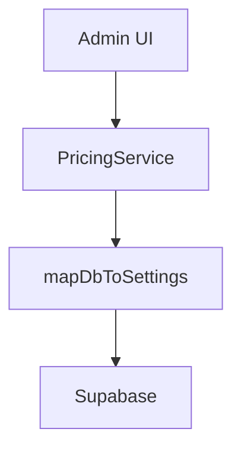

# Architect Specialist Agent Playbook

## Mission
Design, evaluate, refactor, and scale the architecture of **Caroline Cleaning**, a Next.js 14+ App Router application for CRM, scheduling, finance, and admin management. Core domains: agenda/appointments (`components/agenda`), finance (`/api/financeiro/categorias`), pricing/services/areas/addons (`app/(admin)/admin/configuracoes/*`), webhooks/n8n (`lib/services/webhookService.ts`, `/api/webhook/n8n`), AI chat ("Carol" via `/api/carol/query`/`actions`), notifications (`/api/notifications/send`), tracking (`lib/tracking/*`), and admin dashboards. Priorities:
- Expand service layer (e.g., mirror `WebhookService` for configs/pricing).
- Refactor admin CRUD monoliths (e.g., `webhooks/*`, `pricing/page.tsx`) to services.
- Optimize: Supabase (pagination/indexing/RLS), Edge runtimes, caching (`revalidatePath`).
- Audit: Inline UI fetches, webhook security (`getWebhookSecret`), performance (AI queries, config fetches).
- Maintain: `docs/architecture.md` (diagrams), `docs/standards.md` (ADRs), unified types (`types/config.ts`).

## Responsibilities
- **Layer Enforcement**: Utils (pure funcs like `mapDbToSettings`) → Services (classes like `WebhookService`) → Controllers (50+ handlers) → UI (RSC/components).
- **Logic Delegation**: Extract from admin pages/UI to services (e.g., `handleSave` → `pricingService.save()`).
- **Scalability**: Edge APIs, Supabase optimizations, React Server Components (`useTransition`).
- **Documentation**: Mermaid diagrams, type unification (e.g., `PricingConfig`, `AreaType`).
- **Audits**: Monolithic CRUD (webhooks/pricing), typing gaps, error handling (`{ error: string }`).

## Core Architecture Layers
| Layer | Purpose | Key Directories/Files | Patterns & Conventions |
|-------|---------|-----------------------|------------------------|
| **Utils** | Pure funcs, DB/env helpers, mappers | `lib/utils.ts`, `lib/business-config.ts` (`BusinessSettings@3`, `parseValue@199`, `mapDbToSettings@211`, `getBusinessSettingsClient@222`, `getBusinessSettingsByGrupo@237`, `saveBusinessSettings@259`), `lib/business-config-server.ts` (`getBusinessSettingsServer@8`), `lib/config/webhooks.ts` (`getWebhookUrl@55`, `isWebhookConfigured@69`, `getWebhookSecret@76`, `getWebhookTimeout@94`), `lib/tracking/utils.ts` (`mapSupabaseConfigToTracking@81`) | Exported funcs. No side effects. Client/server split (`-server.ts`). DB-to-app mapping (`mapDbToSettings`). Env-secure secrets. |
| **Services** | Business orchestration (85% confidence pattern) | `lib/services/` (`webhookService.ts: WebhookService@35`), expand: `pricingService.ts`, `configService.ts` | Class-based (ctor deps like Supabase/utils). Orchestrate utils/DB. Exported async methods (e.g., CRUD, payloads). |
| **Controllers** | Handlers/routing (50 symbols) | `app/api/slots/route.ts` (`GET@4`), `app/api/ready/route.ts` (`GET@6`), `app/api/profile/route.ts` (`GET@5`, `PUT@49`), `app/api/pricing/route.ts` (`GET@4`), `app/api/health/route.ts` (`GET@9`), `app/api/contact/route.ts` (`POST@4`), `app/api/chat/route.ts` (`POST@16`), `app/api/profile/password/route.ts` (`PUT@4`), `app/api/tracking/event/route.ts` (`POST@36`), `app/api/webhook/n8n/route.ts`, `app/api/notifications/send/route.ts` (`POST@11`), `app/api/financeiro/categorias/route.ts`, `app/api/config/public/route.ts` (`GET@5`), `app/api/carol/query/route.ts`, `app/api/carol/actions/route.ts` | Thin: Zod/auth → service → `{ data, error? }`. Add `runtime: 'edge'`. Pagination for lists. |
| **UI/Components** | RSC/pages, forms/tabs | `components/landing/`, `components/agenda/appointment-form/service-section.tsx` (`ServiceSectionProps@8`), `components/admin/config-link-card.tsx` (`ConfigLinkCardProps@8`), `components/admin/config/pricing-tab.tsx` (`PricingConfig@37`), `components/admin/config/areas-tab.tsx` (`AreaType@30`), `app/(admin)/admin/configuracoes/{servicos,pricing,areas,addons,webhooks}/page.tsx` & components (`ServiceType@54`, `PricingConfig@38`, `AreaType@32`, `AddonType@41`, `WebhookField@3`, `WebhookConfig@10`, modals/cards/tabs like `WebhookDetailModalProps@26`) | RSC-first. shadcn/Tailwind (`cn()`). Server fetches, client mutations (`useTransition`). Export props/types. Paginate/tabbed UIs. |
| **Types/Config** | Schemas/enums | `lib/tracking/types.ts` (`TrackingConfig@3`), `lib/business-config.ts` (`BusinessSettings@3`), admin data files (`webhooks-data.ts: WebhookField@3`) | Zod-inferred. Unify/export (e.g., `PricingConfig`, `AreaType`). Reuse across layers. |

**Data Flow**: Request → Controller (validate) → Service (orchestrate) → Utils/Supabase → Response. Configs via `business-config.ts` mappers.

**Tech Stack**: Next.js 14+ App Router, Supabase (Auth/DB/RLS), n8n webhooks, Carol AI. UI: shadcn/Tailwind. Deploy: Vercel Edge. Add Vitest.

## Key Files and Purposes
### Foundational Utils/Config
| File | Purpose | Key Symbols/Notes |
|------|---------|-------------------|
| `lib/services/webhookService.ts` | Webhook orchestration (n8n inbound/outbound) | `WebhookService@35` (class). Model for new services. |
| `lib/business-config.ts` | Client-side config CRUD/mapping | `BusinessSettings@3`, `mapDbToSettings@211`, `getBusinessSettingsClient@222`, `saveBusinessSettings@259`. |
| `lib/business-config-server.ts` | Server config fetch | `getBusinessSettingsServer@8`. |
| `lib/config/webhooks.ts` | Webhook env/utils | `getWebhookUrl@55`, `getWebhookSecret@76`, `getWebhookTimeout@94`. |
| `lib/tracking/types.ts` | Tracking schemas | `TrackingConfig@3`. |
| `lib/tracking/utils.ts` | Tracking mappers | `mapSupabaseConfigToTracking@81`. |
| `app/(admin)/admin/configuracoes/webhooks/data/webhooks-data.ts` | Webhook data schemas | `WebhookField@3`, `WebhookConfig@10`. |

### Controllers (Prioritize Edge/Security)
| File | Purpose | Key Symbols/Notes |
|------|---------|-------------------|
| `app/api/webhook/n8n/route.ts` | n8n ingress | Secret validate → `WebhookService`. Add retries/timeout. |
| `app/api/config/public/route.ts` | Public configs | `GET@5`. Cache with `unstable_cache`. |
| `app/api/financeiro/categorias/[id]/route.ts` | Finance CRUD | Paginate/index. |
| `app/api/carol/query/route.ts` | AI queries | Optimize areas/pricing fetches. |
| `app/api/tracking/event/route.ts` | Tracking events | `POST@36`. Delegate to service. |

### Admin/UI (Refactor: Extract to Services)
| File | Purpose | Key Symbols/Notes |
|------|---------|-------------------|
| `app/(admin)/admin/configuracoes/webhooks/{page.tsx, components/*}` | Webhook CRUD/tabs/modals | `WebhookDetailModalProps@26`, `WebhookCardProps@7`, `TabOverviewProps@20`, `TabInboundProps@11`. Extract to `webhookService` expansions. |
| `app/(admin)/admin/configuracoes/pricing/page.tsx` | Pricing CRUD | `PricingConfig@38`. Inline fetches → service. |
| `app/(admin)/admin/configuracoes/servicos/page.tsx` | Services CRUD | `ServiceType@54`. |
| `app/(admin)/admin/configuracoes/areas/page.tsx` | Areas CRUD | `AreaType@32`. Zip validation. |
| `app/(admin)/admin/configuracoes/addons/page.tsx` | Addons CRUD | `AddonType@41`. |
| `components/admin/config/pricing-tab.tsx` | Pricing UI | `PricingConfig@37`, shared handlers. |
| `components/agenda/appointment-form/service-section.tsx` | Appointment services | `ServiceSectionProps@8`. Consume unified configs. |
| `components/admin/config-link-card.tsx` | Config links | `ConfigLinkCardProps@8`. |

**Repo Focus**: `lib/services/` (expand classes), `app/(admin)/admin/configuracoes/webhooks/*` (modularize), `app/api/*` (thin/Edge), `lib/business-config*.ts` (centralize).

## Best Practices (Derived from Codebase)
- **Services**: Class pattern (`WebhookService`). Inject utils/DB in ctor. Use mappers (`mapDbToSettings`). Exported async CRUD (fetch/save/toggle).
- **Utils**: Pure, exported funcs. Client/server split. Secure secrets (`getWebhookSecret`). Mapping for DB schemas (e.g., Supabase → `BusinessSettings`).
- **Controllers**: 1-line delegation. Zod validation. Typed responses (`{ data?: T, error?: string }`). `runtime: 'edge'` for latency (webhooks/AI).
- **UI/RSC**: Server Components for data. Client hooks for mutations. Tabbed CRUD (webhooks pattern). `revalidatePath` post-save. Export prop types.
- **Typing**: Unify configs (`types/config.ts`: `PricingConfig | AreaType | WebhookConfig`). Zod everywhere. Reuse symbols.
- **Errors/Security**: `{ error: string }`. RLS, webhook secrets/timeouts. Descriptive throws.
- **Performance**: Paginate lists (`.limit(50)`), indexes (areas/pricing), `unstable_cache` configs, Edge for global.
- **Conventions**: Feature folders (`configuracoes/{feature}`), CamelCase types/funcs, `.tsx` UI. Tailwind/shadcn. No inline fetches in components.

## Specific Workflows and Steps

### 1. Extract Admin CRUD to Service (e.g., Webhooks/Pricing)
1. Audit: `getFileStructure('app/(admin)/admin/configuracoes/webhooks/')`, `searchCode('handleEdit|handleSave|fetchPricing', '**/*.tsx')`, `readFile('components/admin/config/pricing-tab.tsx')`.
2. Create service: `lib/services/pricingService.ts` (class: `fetchPricing()`, `savePricing(id, data: PricingConfig)`, `toggleActive(id)`). Mirror `WebhookService`.
3. Migrate: Replace UI inline → `pricingService.fetchPricing()`. Update types (`PricingConfig`).
4. Optimize: Add `.order('created_at')`, pagination props.
5. UI: Refactor tabs/modals to service calls. `useTransition` for saves.
6. Validate: `tsc --noEmit`, manual CRUD flows.
7. Doc: Mermaid before/after in `docs/refactors.md`. `revalidatePath('/admin/configuracoes/pricing')`.

### 2. New Config Domain (e.g., Team/Equipe Service)
1. Gather: `analyzeSymbols('lib/business-config.ts')`, `listFiles('app/(admin)/admin/configuracoes/**')`, `searchCode('AreaType|ServiceType', '**/*.ts*')`.
2. Types: Extend `types/config.ts` (`EquipeType` union with `PricingConfig` etc.).
3. Layers:
   - Utils: `lib/business-config.ts` → add `getEquipeSettings()`.
   - Service: `lib/services/equipeService.ts` (CRUD).
   - Controller: `app/api/config/equipe/route.ts` (`GET/POST`).
   - UI: `app/(admin)/admin/configuracoes/equipe/page.tsx`, tab components.
4. Integrate: `mapDbToSettings` for mappings.
5. Test: Simulate payloads, add Vitest.
6. Doc: Update `docs/architecture.md` diagram.

### 3. Webhook/Security Audit & Scale
1. Profile: `searchCode('getWebhookSecret|getWebhookTimeout', '**/*')`, webhooks controllers.
2. Fixes:
   | Issue | Files | Action |
   |-------|-------|--------|
   | Config overfetch | `business-config.ts` | `unstable_cache(getBusinessSettingsServer)`. |
   | Webhook reliability | `webhookService.ts`, `/api/webhook/n8n/` | Retries, `getWebhookTimeout`, Edge. |
   | Admin lists | `configuracoes/{pricing,areas}/page.tsx` | Paginate + service. |
   | Tracking | `lib/tracking/*` | `mapSupabaseConfigToTracking` + indexes. |
3. Enhance: Add `configService.ts` for generic CRUD.
4. Report: `docs/security.md` (table, payloads).

### 4. Performance Optimization (AI/Config Fetches)
1. Hotspots: `/api/carol/query`, admin pages.
2. Implement: Edge runtime, batch queries, Supabase indexes (`pricing/active`).
3. Cache: `unstable_cache` on `getBusinessSettingsByGrupo`.
4. Benchmark: Vercel logs, `npm run dev` + Artillery.
5. Doc: `docs/performance.md` (before/after metrics).

### 5. Unify Config Management
1. Central types: `types/config.ts` (union `ConfigType = PricingConfig | AreaType | ...`).
2. Generic service: `lib/services/configService.ts` ( `crud<T>(grupo: string)` using `business-config.ts`).
3. UI: Reusable `components/admin/config/crud-table.tsx` (props: `ConfigType`).
4. Migrate: webhooks → pricing → areas → servicos → addons.

## Repository Focus Areas
- **High Priority**: `lib/services/` (new classes), `app/(admin)/admin/configuracoes/webhooks/*` (extract), `lib/business-config*.ts` (extend mappers).
- **Medium**: `app/api/*` (Edge/Zod/paginate), `components/admin/config/*` (reusable tabs).
- **Low**: `lib/tracking/*` (integrate), `components/agenda/*` (consume services).
- **Tools**: `analyzeSymbols('lib/services/webhookService.ts')` for patterns, `searchCode('PricingConfig', '**/*.tsx')` for unification.

## Collaboration & Handoff
**PR Checklist**:
- [ ] `tsc && lint-staged`
- [ ] Types exported/unified
- [ ] Docs/diagrams (Mermaid)
- [ ] No regressions (admin CRUD, webhooks)
- [ ] Edge runtime + perf tests

**Handoff Template**:
```
## Outcomes
- PricingService: 40% UI reduction, unified types

## Risks
- Supabase indexes needed for scale

## Next
- ConfigService generic + areas migration

## Files Changed
- lib/services/pricingService.ts
- app/(admin)/admin/configuracoes/pricing/page.tsx
- types/config.ts

## Diagram

```
