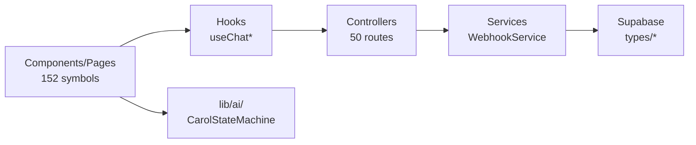

# Architecture

**Status**: Active  
**Generated**: 2024-10-06  
**Last Updated**: 2024-10-12  
**Total Files**: 183 | **Symbols**: 284 | **Languages**: .ts(44), .tsx(137), .mjs(2)

## System Overview

Carolinas Premium is a **monolithic full-stack Next.js 14+ application** using the App Router. It provides CRM functionality for client management (`Cliente`), appointment scheduling (`Agendamento`), financial tracking (`Financeiro`), analytics (`DashboardStats`), and an AI-powered chat assistant ("Carol"). Deployed as a single artifact on Vercel, EasyPanel, or Docker.

### Core Technology Stack
| Layer | Technologies |
|-------|--------------|
| **Frontend** | React 18+, Tailwind CSS, shadcn/ui, TypeScript |
| **Backend** | Next.js API Routes, Server Actions |
| **Database** | Supabase (Postgres + Auth + Realtime) |
| **Styling** | Tailwind + `cn()` utility ([lib/utils.ts](lib/utils.ts)) |
| **AI/Integrations** | Carol AI (custom LLM agent), N8N Webhooks, Twilio SMS |
| **Exports** | Excel/PDF ([lib/export-utils.ts](lib/export-utils.ts)) |
| **Charts** | Recharts (analytics funnels/trends) |

### Request Flow
```
Public Visitor → Root Layout (app/layout.tsx) → SSR Pages (app/(public)/) → Supabase RLS Queries
                  ↓ (Middleware: rateLimit, auth)
Authenticated Admin → Admin Layout (app/(admin)/layout.tsx) → Dynamic Pages → Hooks → API Routes → Supabase + Webhooks
Chat Widget → /api/chat → Carol AI (CarolStateMachine) → /api/webhook/n8n → Services → Notifications/DB Updates
```
- **Auth Flow**: Supabase Auth → `updateSession` ([lib/supabase/middleware.ts](lib/supabase/middleware.ts)) → Protected Routes.
- **Realtime**: Supabase subscriptions via hooks (e.g., `useChat` [hooks/use-chat.ts](hooks/use-chat.ts)).

## Dependency Graph
High-level module dependencies (inferred from imports/exports):

```
Config (.) ─→ Utils (lib/*)
Utils ─→ Controllers (app/api/*, lib/ai/state-machine/handlers/*)
Services (lib/services/*) ─→ Components (components/*)
Controllers ─→ Components (app/(admin)/(public)/, components/ui/*)
```

**Top Dependencies** (most imported files):
- `lib/ai/state-machine/handlers/index.ts` (10 importers)
- `components/agenda/appointment-modal.tsx` (8 importers)
- `components/agenda/calendar-view.tsx` (5 importers)
- `lib/ai/carol-agent.ts` (3 importers)

## Architectural Layers

### 1. Utils (`lib/`)
Reusable primitives: **55+ symbols** (formatting, Supabase clients, logger, tracking, AI prompts, rate limiting).

- **Key Files**:
  | File | Exports | Usage Example |
  |------|---------|---------------|
  | [lib/utils.ts](lib/utils.ts) | `cn`, `formatCurrency`, `formatDate` | `cn("btn", isActive && "btn-primary")` |
  | [lib/formatters.ts](lib/formatters.ts) | `formatPhoneUS`, `isValidEmail`, `formatCurrencyInput` | `<Input value={formatCurrencyInput(val)} />` |
  | [lib/supabase/server.ts](lib/supabase/server.ts) | `createClient` | `await createClient().from('clientes').select('*')` |
  | [lib/logger.ts](lib/logger.ts) | `Logger` | `new Logger().info('Event', { data })` |
  | [lib/rate-limit.ts](lib/rate-limit.ts) | `checkRateLimit`, `getClientIp` | `if (await checkRateLimit(ip)) return;` |
  | [lib/ai/llm.ts](lib/ai/llm.ts) | `CarolLLM` | Custom OpenAI wrapper for structured extraction |
  | [lib/ai/state-machine/engine.ts](lib/ai/state-machine/engine.ts) | `CarolStateMachine` | `const machine = new CarolStateMachine(state)` |
  | [lib/business-config.ts](lib/business-config.ts) | `BusinessSettings` | `getBusinessSettingsClient()` |
  | [lib/notifications.ts](lib/notifications.ts) | `notify`, `notifyOwner` | `notify(NotificationTypes.LEAD_CREATED, data)` |

### 2. Services (`lib/services/`)
Business logic: **~5 symbols** (webhooks, chat logging).

- **Key Classes**:
  | Class | File | Purpose |
  |-------|------|---------|
  | `WebhookService` | [lib/services/webhookService.ts](lib/services/webhookService.ts) | Handles `WebhookPayload` (leads, appointments, payments) |
  | `ChatLoggerService` | [lib/services/chat-logger.ts](lib/services/chat-logger.ts) | Logs `ChatMessage`, generates `SessionSummary` |

### 3. Components & Pages (`components/`, `app/`)
**152+ symbols**. UI layer with heavy use in admin dashboard.

- **Key Components**:
  | Category | Examples | Props/Types |
  |----------|----------|-------------|
  | **Chat** | `ChatWidget`, `ChatWindow`, `ChatInput` | `ChatMessage[]` |
  | **Agenda** | `CalendarView`, `AppointmentForm` ([components/agenda/](components/agenda/)) | `AppointmentFormData`, `ServicoTipo`, `Addon` |
  | **Clients** | `ClientsFilters`, `ClientsTable` | `Cliente[]` |
  | **Admin** | `AdminLayout`, `AdminHeader` | Contexts: `BusinessSettingsProvider`, `AdminI18nProvider` |
  | **Analytics** | Trends/Satisfaction charts | `DashboardStats` |
  | **Financeiro** | `CategoryQuickForm` | `Categoria[]` |

- **Pages** (App Router):
  | Group | Examples |
  |-------|----------|
  | `(admin)` | `/admin/agenda` (`AgendaPage`), `/admin/clientes/[id]` (`ClienteDetalhePage`), `/admin/chat-logs/[sessionId]` (`ChatLogDetailPage`) |
  | `(public)` | Landing, `/contrato/[id]/assinar` |

### 4. Hooks (`hooks/`)
**10+ hooks** for state/API/realtime.

| Hook | Purpose | Returns |
|------|---------|---------|
| `useChat` | Chat messages/sending | `{ messages, sendMessage }` |
| `useWebhook` | Webhook notifications | `UseWebhookResult` (e.g., `useNotifyAppointmentCreated`) |
| `useCarolChat` | Carol AI integration | `UseCarolChatReturn` |

### 5. Controllers (API Routes `app/api/`)
**50+ symbols**, Zod-validated.

| Route | Key Exports | Payloads |
|-------|-------------|----------|
| `/api/chat` | Chat handling | `ChatMessage` → `CarolAgent` |
| `/api/webhook/n8n` | N8N events | `WebhookPayload` (15+ types: `AppointmentCreatedPayload`, etc.) |
| `/api/carol/query` / `actions` | AI state machine | `CarolState`, `UserIntent` |
| `/api/tracking/event` | Analytics events | `TrackingEventData` |
| `/api/notifications/send` | Owner alerts | `NotificationData` |

- **Middleware** ([middleware.ts](middleware.ts)): Rate limiting + auth.

### 6. Types (`types/`)
Core contracts (**30+**).

| File | Key Types |
|------|-----------|
| [types/index.ts](types/index.ts) | `Cliente(Insert/Update)`, `Agendamento(Insert/Update)`, `DashboardStats`, `AgendaHoje` |
| [types/webhook.ts](types/webhook.ts) | `WebhookEventType`, 15+ `Payload`s (e.g., `LeadCreatedPayload`, `ClientBirthdayPayload`) |
| [lib/ai/state-machine/types.ts](lib/ai/state-machine/types.ts) | `CarolState`, `StateHandler`, `HandlerResult` |

## Design Patterns & Conventions
- **AI State Machine**: `CarolStateMachine` + handlers (`lib/ai/state-machine/handlers/*.ts`) for intents (booking, greeting, customer).
- **Event-Driven**: Webhooks → Services → DB/Notifications (idempotent via timestamps).
- **Custom Hooks**: Encapsulate API calls (e.g., `useNotify*` variants).
- **Server Actions**: Mutations like `sendWebhookAction`.
- **Contexts**: Business settings, i18n, tracking (`lib/tracking/`).
- **Validation**: Zod in API routes; phone/ZIP formatters.

## Public API (Top Exports)
```ts
// Utils
import { cn } from '@/lib/utils';
import { checkRateLimit } from '@/lib/rate-limit';
import { notify } from '@/lib/notifications';

// AI
import { CarolAgent } from '@/lib/ai/carol-agent';
import { CarolStateMachine } from '@/lib/ai/state-machine/engine';

// Components
import { ChatWidget } from '@/components/chat/chat-widget';
import { CalendarView } from '@/components/agenda/calendar-view';

// Types
import type { Cliente, WebhookPayload } from '@/types';
```

## External Dependencies
| Service | Integration |
|---------|-------------|
| **Supabase** | RLS, realtime ([types/supabase.ts](types/supabase.ts)) |
| **N8N** | `/api/webhook/n8n` (HMAC via `getWebhookSecret`) |
| **Carol AI** | `CarolLLM` (OpenAI), `buildCarolPrompt` |
| **Twilio** | `sendSMS` ([lib/twilio.ts](lib/twilio.ts)) |

## Diagrams

### High-Level Flow
```mermaid
graph TD
    A[Public/Admin] --> B[Middleware<br/>rateLimit/auth]
    B --> C[Pages/Hooks<br/>useChat/useWebhook]
    C --> D[/api/chat<br/>CarolAgent]
    D --> E[CarolStateMachine<br/>Handlers]
    C --> F[/api/webhook/n8n<br/>WebhookService]
    E --> F
    F --> G[Supabase]
    F --> H[N8N/Notifications]
    G -.-> I[Realtime]
```

### Domain Layers


## Key Decisions & Risks
| Area | Decision | Risks |
|------|----------|-------|
| **Monolith** | Single Next.js deploy | Scale via Vercel edge |
| **Supabase** | Full BaaS | Export schema for migrations |
| **State Machine** | Typed handlers for Carol | Test coverage (`__tests__`) |
| **Webhooks** | Typed payloads | Idempotency, timeouts |

## Directory Structure
```
app/
├── (admin)/layout.tsx (AdminLayout)
├── api/ (chat, webhook/n8n, carol/*, tracking/*)
├── (admin)/admin/ (agenda, clientes/[id], chat-logs/[sessionId], analytics/*)
components/
├── agenda/ (CalendarView, AppointmentForm – top deps)
├── chat/ (ChatWidget)
├── admin/ (header, sidebar)
lib/
├── ai/ (carol-agent, state-machine – handlers/tests)
├── services/ (webhookService, chat-logger)
├── utils.ts, supabase/, tracking/
types/ (index.ts, webhook.ts)
```

## Development Guidelines
1. **Extend Types**: Update [types/index.ts](types/index.ts); regen Supabase types.
2. **Hooks First**: `use*` for API/realtime (e.g., derive `useNotifyFeedbackReceived`).
3. **Components**: Props interfaces + `cn()`; colocate in `appointment-form/`.
4. **API**: Zod + auth; use `WebhookPayload` union.
5. **AI Handlers**: Add to `lib/ai/state-machine/handlers/`; test in `__tests__/`.
6. **Debug**: `Logger`, Supabase Studio, scripts (`scripts/run_booking_scenarios.ts`).
7. **New Feature**: Types → Service → Hook → Component → Page → Migration.

## Related Files
- [project-overview.md](project-overview.md)
- Supabase schema: `supabase/migrations/`
- AI Tests: `lib/ai/state-machine/__tests__/`
- Scripts: `scripts/` (chat scenarios, zip checks)
