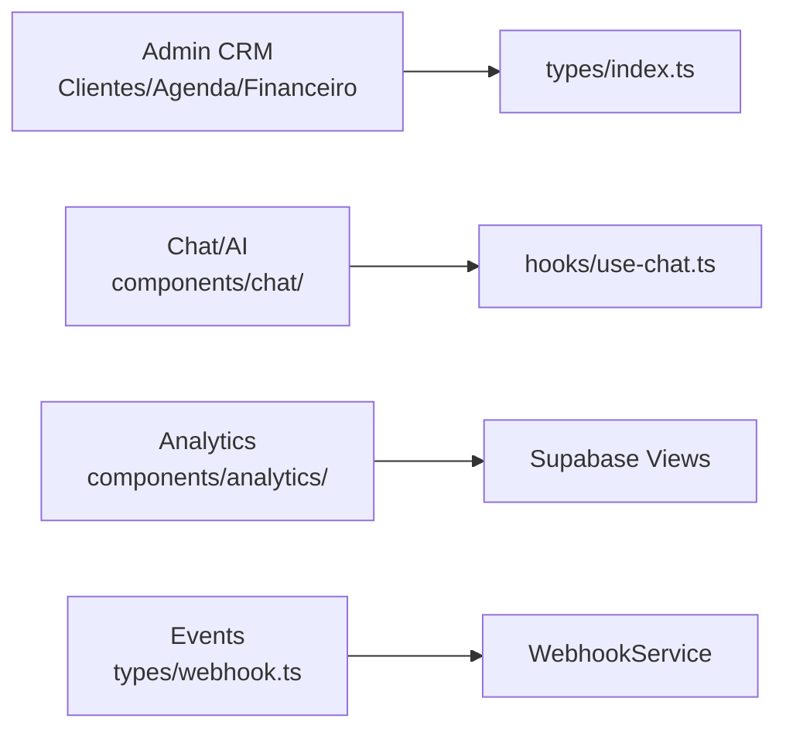

# Architecture

**Status**: Active  
**Generated**: 2024-10-06  
**Last Updated**: 2024-10-06  
**Total Files**: 156 | **Symbols**: 247 | **Languages**: TypeScript/TSX (primary), .mjs

## System Overview

Carolinas Premium is a **monolithic full-stack Next.js 14+ application** using the App Router. It functions as a CRM for client management, appointment scheduling, financial tracking, analytics, and an AI-powered chat assistant named "Carol". Deployed as a single artifact (Vercel/EasyPanel/Docker recommended).

### Core Technology Stack
| Layer | Technologies |
|-------|--------------|
| **Frontend** | React 18+, Tailwind CSS, shadcn/ui, TypeScript |
| **Backend** | Next.js API Routes, Server Actions |
| **Database** | Supabase (Postgres + Auth + Realtime) |
| **Styling** | Tailwind + `cn()` utility (lib/utils.ts) |
| **AI/Integrations** | Carol AI (custom API), N8N Webhooks |
| **Exports** | Excel/PDF (lib/export-utils.ts) |

### Request Flow
```
Public Visitor → Root Layout (app/layout.tsx) → SSR Pages (app/(public)/) → Supabase RLS Queries
                  ↓ (Middleware: rateLimit, auth)
Authenticated Admin → Admin Layout (app/(admin)/layout.tsx) → Dynamic Pages → Hooks → API Routes → Supabase + Webhooks
Chat Widget → /api/chat → Carol AI → /api/webhook/n8n → Notifications/DB Updates
```
- **Auth Flow**: Supabase Auth → `updateSession` (lib/supabase/middleware.ts) → Protected Routes.
- **Realtime**: Supabase subscriptions via hooks (e.g., `useChat` in hooks/use-chat.ts).

## Architectural Layers

### 1. Utils (`lib/`)
Reusable primitives: formatting, Supabase clients, exports, config, actions, logger.

- **Key Files**:
  | File | Exports | Usage Example |
  |------|---------|---------------|
  | `lib/utils.ts` | `cn`, `formatCurrency`, `formatDate` | `cn("btn", isActive && "btn-primary")` |
  | `lib/formatters.ts` | Phone/Email/ZIP validation, `formatCurrencyUSD`/`BRL` | `formatCurrencyInput(value)` in forms |
  | `lib/export-utils.ts` | `exportToExcel`, `exportToPDF` | `<button onClick={() => exportToExcel(data)}>Export</button>` |
  | `lib/supabase/` | `createClient` (server/client) | `const { data } = await supabase.from('clientes').select('*')` |
  | `lib/logger.ts` | `Logger` class | `logger.info('Event', { payload })` |

- **Symbols**: 31 (mostly functions/types).

### 2. Services (`lib/services/`)
Business logic isolation (lightweight layer).

- **Key**: `WebhookService` (lib/services/webhookService.ts) – Processes payloads (leads, appointments, feedback).
- **Pattern**: DB ops + external notifications; injected via hooks.

### 3. Components & Pages (`components/`, `app/`)
- **Components**: 119 symbols (UI primitives, views).
  | Category | Examples | Props Interface |
  |----------|----------|-----------------|
  | **Chat** | `ChatWidget`, `ChatWindow`, `ChatInput` | `ChatWindowProps`, `ChatInputProps` |
  | **Clients** | `ClientsFilters`, `ClientsTable` | `ClientsFiltersProps` |
  | **Analytics** | `ConversionFunnel`, `TrendsChart`, `SatisfactionChart` | `TrendsChartProps` |
  | **Financeiro** | `TransactionForm`, `ExpenseCategories` | `TransactionFormProps` |
  | **Agenda** | Calendar views (day/week/month) | `ViewType` enum |
  | **Admin** | `AdminHeader`, `AdminLayout` | N/A |

- **Pages** (App Router):
  | Route | File | Features |
  |-------|------|----------|
  | `/admin/agenda` | `app/(admin)/admin/agenda/page.tsx` | `AgendaPage` scheduler |
  | `/admin/clientes/[id]` | `app/(admin)/admin/clientes/[id]/page.tsx` | `ClienteDetalhePage` (tabs: info, financeiro, contrato, agendamentos) |
  | `/admin/analytics/*` | Various | `ClientesAnalyticsPage`, trends, funnels |

### 4. Hooks (`hooks/`)
Custom React logic for state/data.

| Hook | File | Purpose | Dependencies |
|------|------|---------|--------------|
| `useChat` | `hooks/use-chat.ts` | Chat messages/sessions | `useChatSession` |
| `useWebhook` & variants (e.g., `useNotifyLeadCreated`) | `hooks/use-webhook.ts` | Event notifications | `WebhookService`, types/webhook.ts |
| `useChatSession` | `hooks/use-chat-session.ts` | Session ID mgmt | Cookies/localStorage |

### 5. Controllers (API Routes, `app/api/`)
40 symbols; handle external/internal APIs.

| Route | Method | File | Payloads/Responses |
|-------|--------|------|--------------------|
| `/api/chat` | POST | `app/api/chat/route.ts` | `ChatRequest` → AI response |
| `/api/webhook/n8n` | POST | `app/api/webhook/n8n/route.ts` | `IncomingWebhookPayload` (leads/appts) → `WebhookService` |
| `/api/carol/query` | POST | `app/api/carol/query/route.ts` | `QueryPayload` |
| `/api/carol/actions` | POST | `app/api/carol/actions/route.ts` | `ActionPayload` |
| `/api/slots` | GET | `app/api/slots/route.ts` | Schedule availability |
| `/api/notifications/send` | POST | `app/api/notifications/send/route.ts` | `NotificationPayload` |

- **Middleware** (`middleware.ts`): `rateLimit` → Auth → `updateSession`.

### 6. Types (`types/`)
Shared contracts (Supabase-generated + custom).

| File | Key Exports |
|------|-------------|
| `types/index.ts` | `Cliente`, `Agendamento`, `Financeiro`, `DashboardStats`, `AgendaHoje` |
| `types/webhook.ts` | `WebhookEventType`, 12+ payloads (e.g., `AppointmentCreatedPayload`, `ChatMessagePayload`) |
| `types/supabase.ts` | `Database`, `Json` |

## Design Patterns & Conventions
| Pattern | Examples | Benefits |
|---------|----------|----------|
| **Custom Hooks** | `useChat`, `useWebhook*` | Encapsulate API calls, retries, state |
| **Server Actions** | `lib/actions/auth.ts` (`signOut`, `getUser`), `webhook.ts` | Secure mutations (no client exposure) |
| **Route Handlers** | All `/api/*` | Typed handlers with Zod/validation |
| **Colocation** | Pages + `loading.tsx` + components | Fast iteration |
| **Event-Driven** | N8N Webhooks → Payload types → Hooks | Decoupled notifications |
| **Props Drilling** | Client ficha tabs (`Tab*Props`) | Scoped state |

## Public API (Exported Symbols)
Reusable across modules/apps:

```ts
// Core utils
import { cn, formatCurrency } from '@/lib/utils';
import { exportToExcel } from '@/lib/export-utils';

// Supabase
import { createClient } from '@/lib/supabase/server';

// Hooks/Components
import { ChatWidget } from '@/components/chat/chat-widget';
import { useChat } from '@/hooks/use-chat';

// Types
import type { Cliente, Agendamento } from '@/types';
```

Full list: 100+ (see symbol index).

## External Dependencies
| Service | Config | Handling |
|---------|--------|----------|
| **Supabase** | `lib/supabase/*`, env keys | RLS, retries via `createClient` |
| **N8N** | `lib/config/webhooks.ts` (`getWebhookSecret`) | HMAC verification, timeouts |
| **Carol AI** | `/api/carol/*` | `QueryPayload`/`ActionPayload` |
| **Libs** | `lucide-react`, `recharts`, `xlsx` (exports) | Tree-shaken |

## Diagrams

### High-Level Flow
```mermaid
graph TD
    A[Client Browser] -->|Public/Chat| B[app/layout.tsx]
    B --> C[Middleware.ts<br/>Auth/RateLimit]
    C --> D[Public Layouts<br/>SSR Pages]
    C --> E[Admin Layout<br/>Protected Pages]
    D --> F[Supabase Client]
    E --> G[API Routes<br/>(chat, webhook, carol)]
    G --> H[Supabase Server]
    G --> I[N8N Webhooks]
    G --> J[Carol AI]
    H --> K[Postgres DB]
    F -.-> K
```

### Domain Boundaries


## Key Decisions & Risks
| Area | Decision | Trade-offs/Risks |
|------|----------|------------------|
| **Monolith** | Single Next.js deploy | Easy; scale limits → Micro-frontends? |
| **Supabase** | Full-stack BaaS | Fast dev; lock-in → Schema exports |
| **No Global State** | Hooks/Context | Lightweight; complexity → Zustand if needed |
| **Webhooks** | N8N for events | Decoupled; failures → Retries/Dead-letter queue |
| **Performance** | SSR + Suspense | SEO good; admin → React.lazy() |
| **Security** | Middleware + RLS | Solid; audit webhooks |

**Constraints**: pt-BR/BRL locale, mobile chat priority.

## Directory Structure
```
app/
├── (admin)/layout.tsx      # AdminHeader + Sidebar
├── (auth)/layout.tsx       # Auth pages
├── api/                    # 20+ routes
├── (admin)/admin/          # Clients, Agenda, Analytics, Financeiro
components/
├── chat/                   # ChatWidget ecosystem (5 files)
├── clientes/               # Table/Filters
├── analytics/              # Charts/Funnels (10+)
├── financeiro/             # Forms/Categories
├── agenda/                 # Views (day/week/month)
lib/                        # Utils (14 files)
hooks/                      # 3 core hooks
types/                      # Domain models
docs/                       # This file + overview
```

## Development Guidelines
- **New Feature**: Add types → Hook → Component → Page → Tests.
- **API**: Use `IncomingEventType`/`WebhookPayload`; verify auth.
- **Styles**: `cn()` + Tailwind; shadcn addons.
- **Exports**: `exportToExcel/PDF` for tables.
- **Debug**: `Logger` + console in dev.

## Related Files
- [Project Overview](project-overview.md)
- [API Routes](api-routes.md)
- Supabase: `types/supabase.ts`, migrations/
- Chat: [components/chat/README.md](components/chat/)
