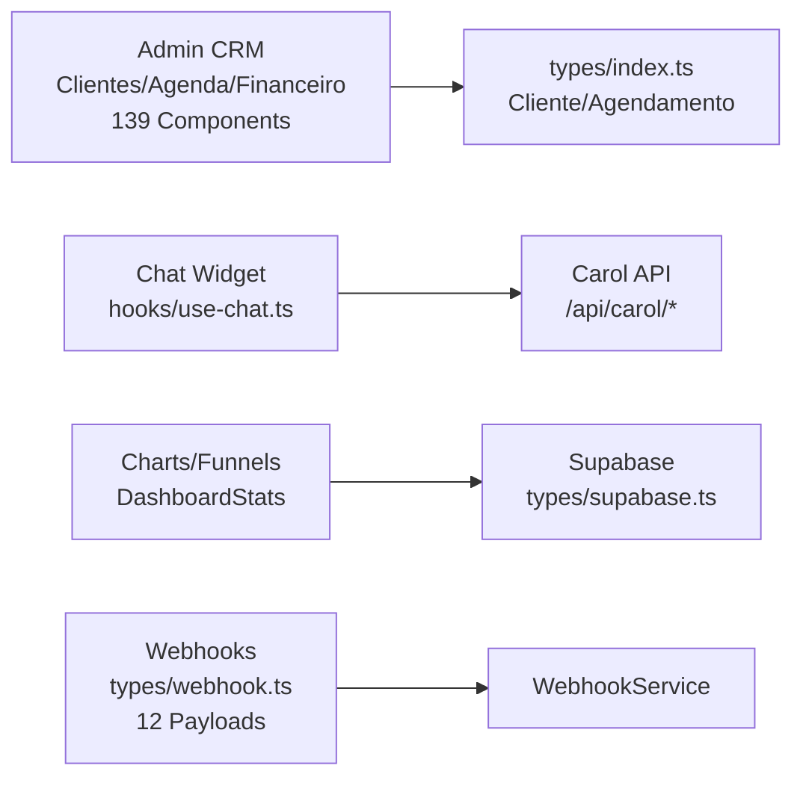

# Architecture

**Status**: Active  
**Generated**: 2024-10-06  
**Last Updated**: 2024-10-11  
**Total Files**: 183 | **Symbols**: 284 | **Languages**: .ts(44), .tsx(137), .mjs(2)

## System Overview

Carolinas Premium is a **monolithic full-stack Next.js 14+ application** using the App Router. It provides CRM functionality for client management (`Cliente`), appointment scheduling (`Agendamento`), financial tracking (`Financeiro`), analytics (`DashboardStats`), and an AI-powered chat assistant ("Carol"). Deployed as a single artifact on Vercel, EasyPanel, or Docker.

### Core Technology Stack
| Layer | Technologies |
|-------|--------------|
| **Frontend** | React 18+, Tailwind CSS, shadcn/ui, TypeScript |
| **Backend** | Next.js API Routes, Server Actions |
| **Database** | Supabase (Postgres + Auth + Realtime) |
| **Styling** | Tailwind + `cn()` utility ([lib/utils.ts](lib/utils.ts)) |
| **AI/Integrations** | Carol AI (custom API), N8N Webhooks |
| **Exports** | Excel/PDF ([lib/export-utils.ts](lib/export-utils.ts)) |
| **Charts** | Recharts (analytics funnels/trends) |

### Request Flow
```
Public Visitor → Root Layout (app/layout.tsx) → SSR Pages (app/(public)/) → Supabase RLS Queries
                  ↓ (Middleware: rateLimit, auth)
Authenticated Admin → Admin Layout (app/(admin)/layout.tsx) → Dynamic Pages → Hooks → API Routes → Supabase + Webhooks
Chat Widget → /api/chat → Carol AI → /api/webhook/n8n → Notifications/DB Updates
```
- **Auth Flow**: Supabase Auth → `updateSession` ([lib/supabase/middleware.ts](lib/supabase/middleware.ts)) → Protected Routes.
- **Realtime**: Supabase subscriptions via hooks (e.g., `useChat` [hooks/use-chat.ts](hooks/use-chat.ts)).

## Architectural Layers

### 1. Utils (`lib/`)
Reusable primitives: 43 symbols (formatting, Supabase clients, exports, config, actions, logger).

- **Key Files**:
  | File | Exports | Usage Example |
  |------|---------|---------------|
  | [lib/utils.ts](lib/utils.ts) | `cn`, `formatCurrency`, `formatDate` | `cn("btn", isActive && "btn-primary")` |
  | [lib/formatters.ts](lib/formatters.ts) | `formatPhoneUS`, `isValidEmail`, `formatCurrencyInput`, `formatZipCode` | `<Input value={formatCurrencyInput(val)} />` |
  | [lib/export-utils.ts](lib/export-utils.ts) | `exportToExcel`, `exportToPDF` | `exportToExcel(clientsData, 'clientes.xlsx')` |
  | [lib/supabase/server.ts](lib/supabase/server.ts), [lib/supabase/client.ts](lib/supabase/client.ts) | `createClient` | `const { data } = await createClient().from('clientes').select('*')` |
  | [lib/logger.ts](lib/logger.ts) | `Logger` class | `new Logger().info('User login', { userId })` |
  | [lib/business-config.ts](lib/business-config.ts) | `BusinessSettings`, `getBusinessSettingsClient`, `saveBusinessSettings` | `const settings = getBusinessSettingsClient()` |
  | [lib/config/webhooks.ts](lib/config/webhooks.ts) | `getWebhookUrl`, `getWebhookSecret`, `isWebhookConfigured` | `if (isWebhookConfigured()) { sendWebhookAction(...) }` |

### 2. Services (`lib/services/`)
Lightweight business logic: 2 symbols.

- **Key**: `WebhookService` ([lib/services/webhookService.ts](lib/services/webhookService.ts)) – processes leads/appointments/feedback/payments.
- **Pattern**: DB ops + notifications; used in hooks/API routes.
- **Dependencies**: Components, [types/webhook.ts](types/webhook.ts).

### 3. Components & Pages (`components/`, `app/`)
- **Components**: 139 symbols (UI primitives/views). Top dependencies: `components/agenda/appointment-modal.tsx` (8 importers), `components/agenda/calendar-view.tsx` (5 importers).
  | Category | Count | Examples | Props |
  |----------|-------|----------|-------|
  | **Chat** | 5+ | `ChatWidget`, `ChatWindow`, `ChatInput` ([components/chat/](components/chat/)) | `ChatWindowProps` |
  | **Clients** | 10+ | `ClientsFilters`, `ClientsTable`, `EditClientModal` ([components/clientes/](components/clientes/)) | `ClientsFiltersProps`, `EditClientModalProps` |
  | **Agenda** | 20+ | `AppointmentForm`, calendar views (day/week/month) ([components/agenda/](components/agenda/)) | `UseAppointmentFormProps`, `AppointmentFormData` |
  | **Analytics** | 10+ | `ConversionFunnel`, `TrendsChart` ([components/analytics/](components/analytics/)) | Recharts props |
  | **Financeiro** | 5+ | `TransactionForm`, `ExpenseCategories`, `CategoryQuickForm` ([components/financeiro/](components/financeiro/)) | `TransactionFormProps`, `ExpenseCategoryProps` |
  | **Admin/Landing** | 20+ | `AdminHeader`, `AdminLayout`, `AnnouncementBar`, `AboutUs` | N/A |

- **Pages** (App Router, parallel routes):
  | Route Group | Key Pages | Features |
  |-------------|-----------|----------|
  | `(admin)` | `/admin/agenda` (`AgendaPage` [app/(admin)/admin/agenda/page.tsx](app/(admin)/admin/agenda/page.tsx)) | Scheduler |
  | | `/admin/clientes/[id]` (`ClienteDetalhePage` [app/(admin)/admin/clientes/[id]/page.tsx](app/(admin)/admin/clientes/[id]/page.tsx)) | Tabs: info/financeiro/contrato/agendamentos/notas |
  | | `/admin/analytics/clientes` (`ClientesAnalyticsPage`) | Client trends |
  | | `/admin/financeiro/categorias` (`CategoriasPage`) | Expense categories |
  | | `/admin/configuracoes/equipe` (`EquipeConfigPage`) | Team settings |
  | `(public)` / `(auth)` | Landing: `AboutUs`; Auth: `AuthLayout` | SSR marketing/auth |

### 4. Hooks (`hooks/`)
Custom React logic: state, data fetching, realtime (10+ hooks).

| Hook | File | Purpose | Example |
|------|------|---------|---------|
| `useChat` | [hooks/use-chat.ts](hooks/use-chat.ts) | Messages/sessions (`ChatMessage`) | `const { messages, sendMessage } = useChat()` |
| `useWebhook` & variants (`useNotifyLeadCreated`, `useNotifyAppointmentCreated`, `useNotifyAppointmentCompleted`, etc.) | [hooks/use-webhook.ts](hooks/use-webhook.ts) | Notifications (`WebhookEventType`) | `const notify = useNotifyAppointmentCreated()` |
| `useChatSession` | [hooks/use-chat-session.ts](hooks/use-chat-session.ts) | Session ID | `const sessionId = useChatSession()` |
| `useAppointmentForm` | [components/agenda/appointment-form/use-appointment-form.ts](components/agenda/appointment-form/use-appointment-form.ts) | Form state (`AppointmentFormData`) | Integrated in `AppointmentForm` |

### 5. Controllers (API Routes, `app/api/`)
44 symbols; Zod-validated handlers.

| Route | Method | File | Payloads |
|-------|--------|------|----------|
| `/api/chat` | POST | [app/api/chat/route.ts](app/api/chat/route.ts) | `ChatRequest` → Carol AI |
| `/api/webhook/n8n` | POST | [app/api/webhook/n8n/route.ts](app/api/webhook/n8n/route.ts) | `IncomingWebhookPayload` → `WebhookService` |
| `/api/carol/query` | POST | [app/api/carol/query/route.ts](app/api/carol/query/route.ts) | `QueryPayload` |
| `/api/carol/actions` | POST | [app/api/carol/actions/route.ts](app/api/carol/actions/route.ts) | `ActionPayload` |
| `/api/slots` | GET | [app/api/slots/route.ts](app/api/slots/route.ts) | Availability slots |
| `/api/financeiro/categorias/[id]` | DELETE | [app/api/financeiro/categorias/[id]/route.ts](app/api/financeiro/categorias/[id]/route.ts) | Category deletion |
| `/api/notifications/send` | POST | [app/api/notifications/send/route.ts](app/api/notifications/send/route.ts) | `NotificationPayload` |

- **Middleware** ([middleware.ts](middleware.ts)): `rateLimit` → Auth → `updateSession`.

### 6. Types (`types/`)
Shared contracts (Supabase + custom).

| File | Key Exports |
|------|-------------|
| [types/index.ts](types/index.ts) | `Cliente(Insert/Update)`, `Agendamento(Insert/Update)`, `Contrato`, `Financeiro`, `DashboardStats`, `AgendaHoje` |
| [types/webhook.ts](types/webhook.ts) | `WebhookEventType`, `WebhookPayload`, 12+ payloads (`LeadCreatedPayload`, `Appointment*Payload`, `ChatMessagePayload`, etc.) |
| [types/supabase.ts](types/supabase.ts) | `Database`, `Json` |
| [components/agenda/types.ts](components/agenda/types.ts) | `ServicoTipo`, `Addon`, `AddonSelecionado`, `AppointmentFormData` |

## Design Patterns & Conventions
| Pattern | Examples | Benefits |
|---------|----------|----------|
| **Custom Hooks** | `useChat*`, `useWebhook*`, `useAppointmentForm` | Reusable API/state logic |
| **Server Actions** | [lib/actions/auth.ts](lib/actions/auth.ts) (`signOut`, `getUser`), [lib/actions/webhook.ts](lib/actions/webhook.ts) (`sendWebhookAction`) | Secure, type-safe mutations |
| **Route Handlers** | `/api/*` (Zod-typed) | Validation + HMAC (webhooks) |
| **Colocation** | Page + `loading.tsx` + local hooks/components | Fast iteration |
| **Event-Driven** | N8N → `WebhookPayload` → Hooks/Services | Decoupling (idempotency via timestamps) |
| **Contexts** | `BusinessSettingsProvider` ([lib/context/business-settings-context.tsx](lib/context/business-settings-context.tsx)), `AdminI18nProvider` ([lib/admin-i18n/context.tsx](lib/admin-i18n/context.tsx)) | Scoped config/i18n |

## Public API (Exported Symbols)
Core reusables (100+; full list via `analyzeSymbols`).

```ts
// Utils
import { cn, formatCurrency } from '@/lib/utils';
import { createClient } from '@/lib/supabase/server';
import { exportToExcel } from '@/lib/export-utils';

// Components/Hooks
import { ChatWidget } from '@/components/chat/chat-widget';
import { AdminLayout } from '@/app/(admin)/layout';
import { useChat } from '@/hooks/use-chat';
import { useNotifyAppointmentCreated } from '@/hooks/use-webhook';

// Types
import type { Cliente, Agendamento, WebhookPayload } from '@/types';
```

## External Dependencies
| Service | Config | Handling |
|---------|--------|----------|
| **Supabase** | Env vars, [lib/supabase/*](lib/supabase/) | RLS, realtime subs |
| **N8N Webhooks** | [lib/config/webhooks.ts](lib/config/webhooks.ts) | HMAC verify (`getWebhookSecret`), retries (`getWebhookTimeout`) |
| **Carol AI** | `/api/carol/*` | Typed payloads (`QueryPayload`, `ActionPayload`) |
| **Libs** | `lucide-react`, `recharts`, `xlsx`, `@supabase/supabase-js` | Tree-shaken |

## Diagrams

### High-Level Flow
```mermaid
graph TD
    A[Browser/Public] --> B[app/layout.tsx]
    B --> C[middleware.ts<br/>rateLimit/auth]
    C --> D[(admin)/layout.tsx<br/>AdminHeader]
    C --> E[Public Pages<br/>ChatWidget]
    D --> F[Pages/Hooks<br/>useChat, useWebhook]
    E --> G[/api/chat<br/>ChatRequest]
    F --> H[/api/*<br/>WebhookService]
    G --> I[Carol AI]
    H --> J[Supabase<br/>Postgres]
    H --> K[N8N Webhooks]
    J -.-> L[Realtime Subs]
```

### Domain Boundaries


## Key Decisions & Risks
| Area | Decision | Trade-offs/Risks |
|------|----------|------------------|
| **Monolith** | Next.js single deploy | Simplicity; vertical scale limits |
| **Supabase** | BaaS w/ RLS | Speed; vendor lock-in (export schema) |
| **No Global State** | Hooks + Context | Performant; prop-drilling in deep tabs |
| **Webhooks** | N8N events | Loose coupling; ensure idempotency |
| **SSR + Suspense** | Default for pages | SEO/mobile good; hydration mismatches |
| **i18n** | `AdminI18nProvider` | Admin-focused; expand to public? |

**Constraints**: pt-BR/BRL focus, US phone/ZIP ([lib/formatters.ts](lib/formatters.ts)), mobile-first chat.

## Directory Structure
```
app/
├── (admin)/layout.tsx          # AdminLayout + i18n
├── (auth)/layout.tsx           # AuthLayout
├── api/                        # 44 controllers (chat/webhook/carol/...)
├── (admin)/admin/              # agenda/clientes/analytics/financeiro/configuracoes
components/
├── chat/                       # ChatWidget + window/input (3 importers)
├── clientes/                   # Table/Filters/Modal
├── agenda/                     # AppointmentForm/Calendar (top deps)
├── analytics/                  # Charts/Funnels
├── financeiro/                 # Forms/Categories
├── cliente-ficha/              # Client detail tabs
lib/
├── utils.ts                    # cn/formatters
├── supabase/                   # Clients/middleware
├── services/                   # WebhookService
├── hooks/                      # useChat/useWebhook
types/                          # index.ts + webhook/supabase
docs/                           # architecture.md
```

## Development Guidelines
1. **Types First**: Extend [types/index.ts](types/index.ts) for models; regenerate [types/supabase.ts](types/supabase.ts).
2. **Hooks for Logic**: Wrap API/DB in `use*` hooks (e.g., `useNotify*`).
3. **Components**: Define props interfaces + `cn()`; colocate forms/hooks (e.g., `use-appointment-form.ts`).
4. **API Routes**: Zod validation + auth; use `WebhookPayload`/`IncomingEventType` for events.
5. **Exports/Charts**: `exportToExcel(data)`; Recharts for `DashboardStats`.
6. **Debug**: `Logger`, Supabase Studio; mock webhooks with `getWebhookUrl`.
7. **New Feature**: Types → Hook → Component → Page → Supabase migration.
8. **Usage Examples**: Search importers (e.g., `components/agenda/appointment-modal.tsx` used in 8 files).

## Related Files
- [Project Overview](project-overview.md)
- [API Routes](api-routes.md)
- Supabase: [types/supabase.ts](types/supabase.ts), `supabase/migrations/`
- Chat: [components/chat/](components/chat/), [hooks/use-chat.ts](hooks/use-chat.ts)
- Tests: `*.test.tsx` (search for examples)
