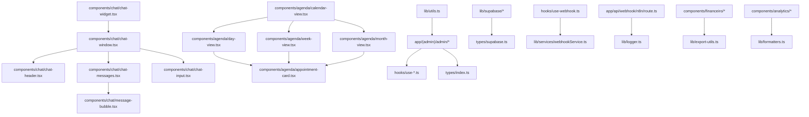
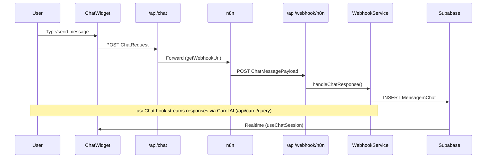
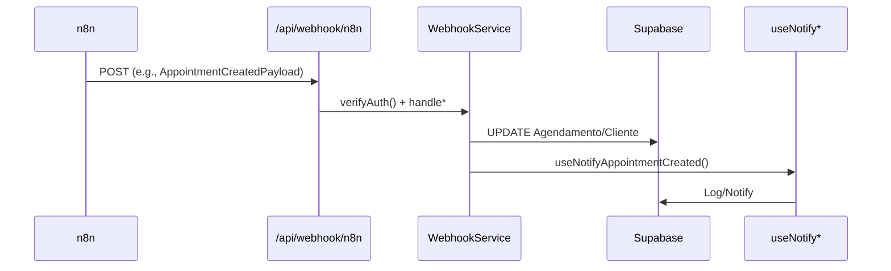

# Data Flow & Integrations

This document details the data flow in **Carolinas Premium**, a Next.js 14 App Router application with Supabase as the backend, n8n for workflow automation, AI chat integration (Carol AI), and an admin dashboard for CRM/financial management. Data enters via user-facing forms/chat, external webhooks, and admin CRUD. It persists in Supabase, triggers notifications via hooks, and outputs reports/charts/exports.

Key principles:
- **Server-first**: Server Components fetch via `lib/supabase/server.ts` (`createClient`).
- **Client orchestration**: Hooks (`hooks/use-chat.ts`, `hooks/use-webhook.ts`) manage state/UI.
- **Event-driven**: n8n webhooks handle async events (leads, appointments, payments).
- **No queues**: Direct HTTP/DB ops; rate-limited via `middleware.ts`.

Cross-references:
- [Types](../types/index.ts) – Core models (`Cliente`, `Agendamento`, `Financeiro`).
- [Webhook Types](../types/webhook.ts) – Event payloads.
- [API Routes](../app/api/) – Entry points.
- [Hooks](../hooks/) – Client logic.
- [Supabase Types](../types/supabase.ts) – `Database` schema.

## Module Dependencies

Core relationships (imports/symbols):



- **Types Hub**: `types/index.ts` – Central export for `Cliente`, `AgendamentoInsert`, `DashboardStats`. Used in 30+ files.
- **Chat Stack**: Relies on `useChat` hook for `ChatMessage[]` state.
- **Agenda**: `calendar-view.tsx` switches views (`ViewType`).
- **Admin/Finance/Analytics**: Shared utils (`cn`, `formatCurrency`).

## Service Layer

| Service | Location | Responsibilities | Dependencies |
|---------|----------|------------------|--------------|
| **WebhookService** | `lib/services/webhookService.ts` | Processes `WebhookPayload` (e.g., `AppointmentCreatedPayload`). Validates HMAC, inserts to DB, triggers notifications. | `getWebhookSecret` (`lib/config/webhooks.ts`), Supabase, `Logger`. |
| **Logger** | `lib/logger.ts` | Structured logs (`LogEntry`, `LogLevel`). | N/A (singleton). |

Logic is hook/API-centric; no heavy domain services.

## High-Level Flows

### 1. Chat Interaction


**Key Hooks**:
- `useChat` (`hooks/use-chat.ts`): Manages `Message[]`, sessions (`generateSessionId`).
- `useSendChatMessage` (`hooks/use-webhook.ts`): Posts to `/api/notifications/send`.

### 2. External Events (n8n Webhooks)
Events like lead creation, appointments, birthdays → n8n → app.



**Supported Events** (`WebhookEventType`):
- `ChatMessagePayload`, `LeadCreatedPayload`, `Appointment*Payload`, `FeedbackReceivedPayload`, `PaymentReceivedPayload`, `ClientInactiveAlertPayload`, `ClientBirthdayPayload`.

Example handler:
```ts
// app/api/webhook/n8n/route.ts
export async function POST(req: Request) {
  const payload = await req.json() as IncomingWebhookPayload;
  if (!verifyAuth(payload)) return new Response('Unauthorized', { status: 401 });
  switch (payload.type) {
    case 'chat_message': return handleChatResponse(payload);
    // ...
  }
}
```

### 3. Admin CRUD & Analytics
Server Components query Supabase directly.

Example (`app/(admin)/admin/clientes/page.tsx`):
```tsx
// Server-side
const supabase = createClient();
const { data: clientes } = await supabase.from('clientes').select('*').order('created_at', { ascending: false });

// Client filters/table
<ClientsFilters onFilter={setFilters} />
<ClientsTable data={clientes as Cliente[]} />
```

- **Dashboard**: `DashboardStats` aggregates `AgendaHoje`.
- **Exports**: `exportToExcel`/`exportToPDF` (`lib/export-utils.ts`) from table data.

### 4. Auth/Session Flow
- Middleware (`middleware.ts`): `rateLimit`, session check (`lib/supabase/middleware.ts`).
- Server actions: `getUser`, `signOut` (`lib/actions/auth.ts`).

## External Integrations

| Integration | Direction | Endpoint/Auth | Payloads | Error Handling |
|-------------|-----------|---------------|----------|---------------|
| **Supabase** | Bi-directional | Service Role Key (server), Anon (client) | `ClienteInsert`, `Database` tables | Hook retries; log errors. Realtime subscriptions implicit. |
| **n8n** | Inbound | HMAC (`getWebhookSecret`), timeout (`getWebhookTimeout`) | All `WebhookPayload` variants | 401/408 on fail; `Logger`. No DLQ. |
| **Carol AI** | Outbound (chat) | Internal routes (`/api/carol/query`, `/api/carol/actions`) | `QueryPayload`, `ActionPayload` | Mock responses in dev; `handleChatResponse`. |
| **Exports** | Client-side | jsPDF/XLSX libs | `DashboardStats`, tables | Browser-only; no server fallback. |

**Outbound**: `sendWebhookAction` (`lib/actions/webhook.ts`) for custom events.

## Observability & Reliability

- **Logging**: `new Logger().info(payload, LogLevel.INFO)` – Used in all API routes/webhooks.
- **Metrics/Charts**: Client-side (e.g., `TrendsChartProps`, `SatisfactionChartProps`).
- **Health Checks**: `GET /api/health`, `/api/ready`.
- **Failures**:
  | Scenario | Handling |
  |----------|----------|
  | Webhook sig fail | 401 + log |
  | Supabase outage | Toasts + fallback UI |
  | Rate limit | 429 via `rateLimit` |
  | Chat timeout | Typing indicator + retry |
- **Tips**: Monitor Supabase query perf, tail `Logger` output. Add Sentry for traces. Test webhooks with `curl -H "Authorization: ..."`.

## Best Practices for Devs

1. **Extend Events**: Add to `types/webhook.ts`, handler in `WebhookService`.
2. **New Hook**: Mirror `useNotify*` pattern → `/api/notifications/send`.
3. **Queries**: Use `createClient` + typed selects (e.g., `supabase.from('clientes').select('*').returns<Cliente[]>()`).
4. **Testing**: Mock n8n payloads in `app/api/webhook/n8n/route.test.ts` (add if missing).
5. **Perf**: Paginate admin tables; cache `DashboardStats` with RSC.

For updates: Re-analyze with `analyzeSymbols` on `app/api/` and `hooks/`. See [full symbols](#) in repo context.
