# Data Flow & Integrations

This document outlines the core data flows in **Carolinas Premium**, a Next.js 14 App Router application using Supabase for persistence, n8n for workflow automation, Carol AI for conversational chat, and an admin dashboard for CRM, scheduling, and finance management. Data enters primarily via chat widgets, admin forms, external webhooks, and API integrations; flows through typed hooks, services, and API routes; persists in Supabase (with realtime subscriptions); and outputs via UI components, exports (Excel/PDF), and notifications.

## Key Principles

- **Server-Side Data Fetching**: Use `createClient` from [`lib/supabase/server.ts`](../lib/supabase/server.ts) in Server Components for secure, efficient queries.
- **Client-Side Interactivity**: Custom hooks (e.g., [`hooks/use-chat.ts`](../hooks/use-chat.ts), [`hooks/use-webhook.ts`](../hooks/use-webhook.ts)) manage state and mutations.
- **Event-Driven Architecture**: n8n triggers webhooks with typed payloads from [`types/webhook.ts`](../types/webhook.ts).
- **Security & Reliability**: Rate-limiting via [`middleware.ts`](../middleware.ts), HMAC validation for webhooks, structured logging with [`lib/logger.ts`](../lib/logger.ts).
- **No Queues/DLQ**: Direct Supabase inserts; handle retries client-side or via n8n.
- **Typing Everywhere**: Leverage [`types/index.ts`](../types/index.ts) (`Cliente`, `Agendamento`, etc.) and [`types/supabase.ts`](../types/supabase.ts) (`Database`).

**Cross-References**:
- [Core Types](../types/index.ts): `Cliente(Insert/Update)`, `Agendamento(Insert/Update)`, `DashboardStats`, `AgendaHoje`.
- [Webhook Types](../types/webhook.ts): `WebhookPayload`, `WebhookEventType`, event-specific interfaces (e.g., `AppointmentCreatedPayload`).
- [API Routes](../app/api/): Chat (`/api/chat`), Webhooks (`/api/webhook/n8n`), Notifications (`/api/notifications/send`), Carol AI (`/api/carol/*`).
- [Hooks](../hooks/): `useChat`, `useWebhook`, `useNotify*`.
- [Services](../lib/services/): `WebhookService`.
- [Utils](../lib/utils.ts), [Formatters](../lib/formatters.ts), [Exports](../lib/export-utils.ts).

## Module Dependencies

```mermaid
graph TD
    ChatWidget[ChatWidget<br/>components/chat/chat-widget.tsx] --> ChatWindow[ChatWindow<br/>components/chat/chat-window.tsx]
    ChatWindow --> ChatMessages[ChatMessages<br/>components/chat/chat-messages.tsx]
    ChatWindow --> ChatInput[ChatInput<br/>components/chat/chat-input.tsx]
    ChatMessages --> MessageBubble[MessageBubble<br/>components/chat/message-bubble.tsx]
    
    CalendarView[CalendarView<br/>components/agenda/calendar-view.tsx] --> DayView[DayView]
    CalendarView --> WeekView[WeekView]
    CalendarView --> MonthView[MonthView]
    DayView --> AppointmentCard[AppointmentCard<br/>components/agenda/appointment-card.tsx]
    WeekView --> AppointmentCard
    MonthView --> AppointmentCard
    
    AdminPages["Admin Pages<br/>app/(admin)/admin/*<br/>(ClientesPage, AgendaPage, etc.)"] --> Hooks["Hooks<br/>hooks/use-*.ts"]
    AdminPages --> Types["types/index.ts"]
    Supabase["lib/supabase/*"] --> SupabaseTypes["types/supabase.ts"]
    
    UseWebhook["hooks/use-webhook.ts<br/>useNotify*"] --> WebhookService["WebhookService<br/>lib/services/webhookService.ts"]
    WebhookRoute["app/api/webhook/n8n/route.ts"] --> Logger["Logger<br/>lib/logger.ts"]
    
    Financeiro["components/financeiro/*<br/>(transaction-form.tsx, expense-categories.tsx)"] --> ExportUtils["lib/export-utils.ts"]
    Analytics["components/analytics/*<br/>(conversion-funnel.tsx)"] --> Utils["lib/utils.ts<br/>lib/formatters.ts"]
    
    BusinessSettings["lib/business-config.ts<br/>BusinessSettingsProvider"] --> Context["lib/context/business-settings-context.tsx"]
    AdminLayout["app/(admin)/layout.tsx<br/>AdminLayout"] --> AdminI18n["lib/admin-i18n/context.tsx<br/>AdminI18nProvider"]
```



- **Types Hub** ([`types/index.ts`](../types/index.ts)): Central export for 20+ models; imported in 30+ files for forms/queries (e.g., `ClienteInsert` in `components/clientes/edit-client-modal.tsx`).
- **Chat Stack**: `useChat` → `Message[]` (`ChatMessage` type); sessions via `lib/chat-session.ts` (`generateSessionId`).
- **Agenda Stack**: `ViewType` enum in [`components/agenda/calendar-view.tsx`](../components/agenda/calendar-view.tsx) routes to Day/Week/Month views; depends on `components/agenda/appointment-modal.tsx` (imported by 8 files).
- **Shared Utils**: `cn` (classNames), `formatCurrency`/`formatDate` ([`lib/utils.ts`](../lib/utils.ts)); phone/zip formatters ([`lib/formatters.ts`](../lib/formatters.ts)).

## Service Layer

| Service/Class | Location | Purpose | Key Methods/Dependencies |
|---------------|----------|---------|--------------------------|
| `WebhookService` | [`lib/services/webhookService.ts`](../lib/services/webhookService.ts) | Validates HMAC (`getWebhookSecret` from [`lib/config/webhooks.ts`](../lib/config/webhooks.ts)), processes `WebhookPayload` variants, inserts/updates Supabase, triggers notifications via `useNotify*` hooks. | Supabase (`createClient`), `Logger`, `getWebhookTimeout`. |
| `Logger` | [`lib/logger.ts`](../lib/logger.ts) | Structured logs (`LogEntry`, `LogLevel`: info/warn/error). Usage: `const logger = new Logger(); logger.info('Event', { payload });`. | None (singleton). |
| `BusinessSettings` | [`lib/business-config.ts`](../lib/business-config.ts) | Loads/saves business config (`mapDbToSettings`, `getBusinessSettingsServer`/`getBusinessSettingsClient`, `saveBusinessSettings`). Wrapped in `BusinessSettingsProvider`. | Supabase; used in admin config pages (e.g., `ConfiguracoesPage`). |

Services are thin; heavy lifting in API routes, hooks, and Server Components.

## High-Level Data Flows

### 1. Chat Flow (User → AI → DB → Realtime UI)
Messages from `ChatWidget` → Carol AI → n8n webhook → persistence → streaming updates.

```mermaid
sequenceDiagram
    participant U as User
    participant CW as ChatWidget
    participant API as /api/chat/route.ts
    participant N8N as n8n
    participant Webhook as /api/webhook/n8n/route.ts
    participant WS as WebhookService
    participant SB as Supabase
    participant Carol as /api/carol/query (streaming)

    U->>+CW: type & send (ChatInput)
    CW->>+API: POST ChatRequest {sessionId, message}
    API->>+N8N: POST getWebhookUrl() + payload
    N8N->>+Webhook: POST ChatMessagePayload
    Webhook->>+WS: verifyHMAC(); handleChatMessage()
    WS->>+SB: INSERT MensagemChat
    Carol->>-CW: Stream responses via useChat()
    SB->>-CW: Realtime sub via useChatSession()
```

**Client Hook Example** (`components/chat/chat-widget.tsx`):
```tsx
const { messages, append, reload } = useChat();
const sendMessage = useSendChatMessage();

const handleSend = async (content: string) => {
  await sendMessage({ sessionId: getSessionId(), content });
  append({ role: 'user', content });
};
```

### 2. n8n Webhook Events (External → App)
Triggers from Stripe/Calendly/Forms → n8n → typed handlers.

```mermaid
sequenceDiagram
    participant Ext as External (Stripe, Calendly)
    participant N8N
    participant Webhook as /api/webhook/n8n
    participant WS
    participant SB
    participant Hooks as useNotify* (client)

    Ext->>+N8N: Event
    N8N->>+Webhook: POST IncomingWebhookPayload {type, payload}
    Webhook->>+WS: verifyAuth(); handleEvent(WebhookEventType)
    alt AppointmentCreated
        WS->>+SB: INSERT Agendamento (AppointmentCreatedPayload)
    end
    WS->>+Hooks: Trigger useNotifyAppointmentCreated(data)
    Hooks->>+SB: Log/notify (e.g., NotificationPayload)
```

**Supported Events** (`WebhookEventType` from [`types/webhook.ts`](../types/webhook.ts)):
- `chat_message` (`ChatMessagePayload`)
- Lead: `lead_created`/`updated`/`converted` (`Lead*Payload`)
- Appointments: `created`/`confirmed`/`completed`/`cancelled`/`rescheduled` (`Appointment*Payload`)
- Other: `feedback_received`, `payment_received`, `client_inactive_alert`, `client_birthday`

**Handler Snippet** (`lib/services/webhookService.ts`):
```ts
async handleAppointmentCreated(payload: AppointmentCreatedPayload) {
  const { data, error } = await supabase
    .from('agendamentos')
    .insert({ ...payload })
    .select()
    .single() as { data: Agendamento; error: any };
  if (error) logger.error('Insert failed', { error, payload });
  await useNotifyAppointmentCreated(data); // Triggers client hook
}
```

### 3. Admin CRUD & Analytics (Direct DB Access)
Server Components fetch lists; client forms mutate via actions.

**Clientes Example** (`app/(admin)/admin/clientes/page.tsx` → `ClientesPage`):
```tsx
// Server Component (RSC)
const supabase = createClient();
const { data: clientes } = await supabase
  .from('clientes')
  .select('*')
  .order('created_at', { ascending: false })
  .returns<Cliente[]>();

// Client Components
<ClientsFilters onFilter={setFilters} />
<ClientsTable data={clientes} />
```

- **Agenda**: `AgendaPage` → `CalendarView` (fetches `Agendamento[]` via `AgendaHoje`).
- **Financeiro**: `transaction-form.tsx` (`TransactionFormProps`) → `Financeiro` inserts; `category-quick-form.tsx`, `expense-categories.tsx`.
- **Analytics**: `ClientesAnalyticsPage`, `ConversionFunnel` → `DashboardStats`.
- **Exports**: `exportToExcel(clientes)` or `exportToPDF()` from tables ([`lib/export-utils.ts`](../lib/export-utils.ts)).

**Config Pages**: `ConfiguracoesPage` → Webhooks tabs (`webhooks-tabs.tsx` imported by 6 files), using `WebhookConfig`/`WebhookField`.

### 4. Authentication & Sessions
Middleware + actions secure routes.

```mermaid
sequenceDiagram
    participant Req as Request
    participant MW as middleware.ts (rateLimit)
    participant Supabase
    participant Pages as AdminLayout/AuthLayout

    Req->>+MW: updateSession(), rateLimit()
    MW->>+Supabase: getUser()
    Supabase-->>-MW: User/Session
    alt Unauthorized
        MW->>-Pages: Redirect /auth
    else Valid
        MW->>-Pages: Proceed (AdminI18nProvider, BusinessSettingsProvider)
    end
```

- Utils: `getUser`, `signOut` ([`lib/actions/auth.ts`](../lib/actions/auth.ts)); `AdminLayout`, `AuthLayout`.

## External Integrations

| Integration | Direction | Auth/Config | Payloads | Error Handling |
|-------------|-----------|-------------|----------|----------------|
| **Supabase** | Bi-directional | Service Role (`server.ts`), Anon (`client.ts`) | `ClienteInsert`, `AgendamentoUpdate`, realtime `MensagemChat` | Typed `returns<T[]>`, `Logger.error`, toasts. |
| **n8n** | Inbound webhooks | HMAC (`getWebhookSecret`), timeout (`getWebhookTimeout`) from [`lib/config/webhooks.ts`](../lib/config/webhooks.ts) | `IncomingWebhookPayload` → `WebhookPayload` | 401 Unauthorized, 408 Timeout + log. |
| **Carol AI** | Outbound (chat/actions) | `/api/carol/query` (`QueryPayload`), `/api/carol/actions` (`ActionPayload`) | Streaming responses | Client retry (`reload` in `useChat`). |
| **Stripe/Calendly** | Inbound via n8n | n8n workflows | Event payloads → `PaymentReceivedPayload`, `Appointment*Payload` | n8n retries. |
| **Exports** | Client-side | jsPDF (`exportToPDF`), SheetJS (`exportToExcel`) | Table data (`DashboardStats`, `Cliente[]`) | Browser-only; fallback CSV. |

**Outbound Webhooks**: `sendWebhookAction` ([`lib/actions/webhook.ts`](../lib/actions/webhook.ts)) for custom events; config in `app/(admin)/admin/configuracoes/webhooks/*`.

## Observability & Reliability

- **Logging**: Ubiquitous `Logger` (e.g., API routes: `logger.error(err, { userId, payload })`).
- **Health Checks**: `GET /api/health`, `/api/ready`, `/api/slots`.
- **Common Errors**:

| Scenario | Response | Mitigation |
|----------|----------|------------|
| Webhook auth fail | 401 + log | Verify `getWebhookSecret`. |
| DB constraint violation | 500 + toast | Validate forms client-side (`isValidPhoneUS`, `isValidEmail`). |
| Rate limit | 429 | Exponential backoff (`rateLimit`). |
| Chat stream timeout | Fallback message | `useChat` `reload()`. |

**Monitoring**: Supabase Logs, console tail, integrate Sentry. Paginate queries (`limit: 50, offset`); indexes on `created_at`, `cliente_id`.

## Developer Best Practices

1. **Extend Events**: Add to `WebhookEventType` → handler in `WebhookService` → `useNotifyNewEvent` hook.
2. **New Mutations**: POST to `/api/notifications/send` (`NotificationPayload`) or direct Supabase in actions.
3. **Queries**: Always `.returns<Cliente[]>()`; use `eq`, `ilike` filters.
4. **Testing**:
   ```bash
   # Webhook curl
   curl -X POST http://localhost:3000/api/webhook/n8n \
     -H "Authorization: sha256=$(echo -n '{"type":"chat_message"}' | openssl dgst -sha256 -hmac $WEBHOOK_SECRET | cut -d' ' -f2)" \
     -H "Content-Type: application/json" -d '{"type":"chat_message", "payload":{...}}'
   ```
5. **Performance**: RSC `cache: 'force-cache'`, Supabase indexes; paginate tables.
6. **New Components**: Follow patterns (props interfaces, `cn` for styling); e.g., `CategoryQuickFormProps`.

See [Public API](../) for all 284+ exports/symbols (e.g., `useNotifyAppointmentCreated`, `ClientsFilters`). Update this doc via PRs.
