# FLOWCHARTS - Chesque PREMIUM CLEANING

**Versão:** 1.0  
**Data:** Dezembro 2024  
**Referência:** PRD v5.0, Schema Supabase, Rotas e Telas

---

## ÍNDICE

- [1. Arquitetura Geral do Sistema](#1-arquitetura-geral-do-sistema)
- [2. Jornada do Novo Lead](#2-jornada-do-novo-lead)
- [3. Fluxo do Chat (Carol IA)](#3-fluxo-do-chat-carol-ia)
- [4. Fluxo de Agendamento](#4-fluxo-de-agendamento)
- [5. Jornada do Cliente Recorrente](#5-jornada-do-cliente-recorrente)
- [6. Fluxo de Notificações](#6-fluxo-de-notificações)
- [7. Fluxo Financeiro](#7-fluxo-financeiro)
- [8. Estados do Cliente](#8-estados-do-cliente)
- [9. Estados do Agendamento](#9-estados-do-agendamento)
- [10. Diagrama de Entidades (ER)](#10-diagrama-de-entidades-er)
- [11. Fluxo de Navegação (Frontend)](#11-fluxo-de-navegação-frontend)
- [12. Fluxo de Autenticação](#12-fluxo-de-autenticação)
- [13. Carol IA - AI Agent Tools](#13-carol-ia---ai-agent-tools)
- [14. Fluxo de Recorrência](#14-fluxo-de-recorrência)
- [15. Fluxo de Feedback](#15-fluxo-de-feedback)

---

## 1. ARQUITETURA GERAL DO SISTEMA

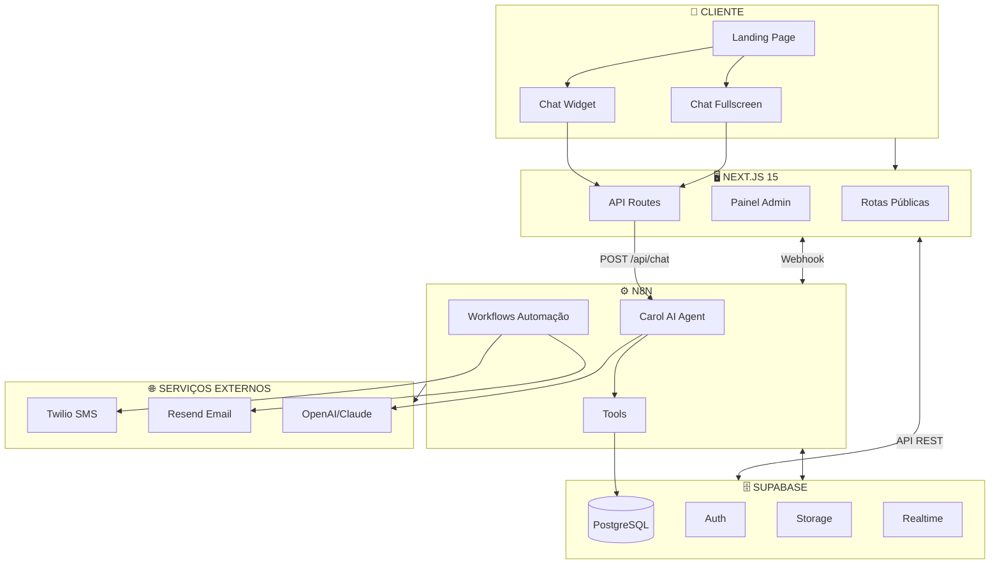

---

## 2. JORNADA DO NOVO LEAD

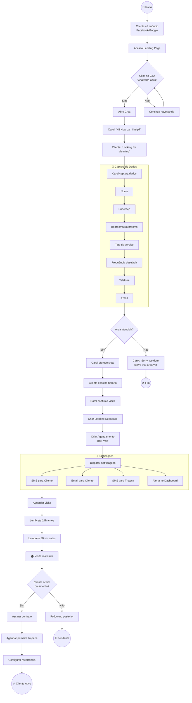

---

## 3. FLUXO DO CHAT (CAROL IA)

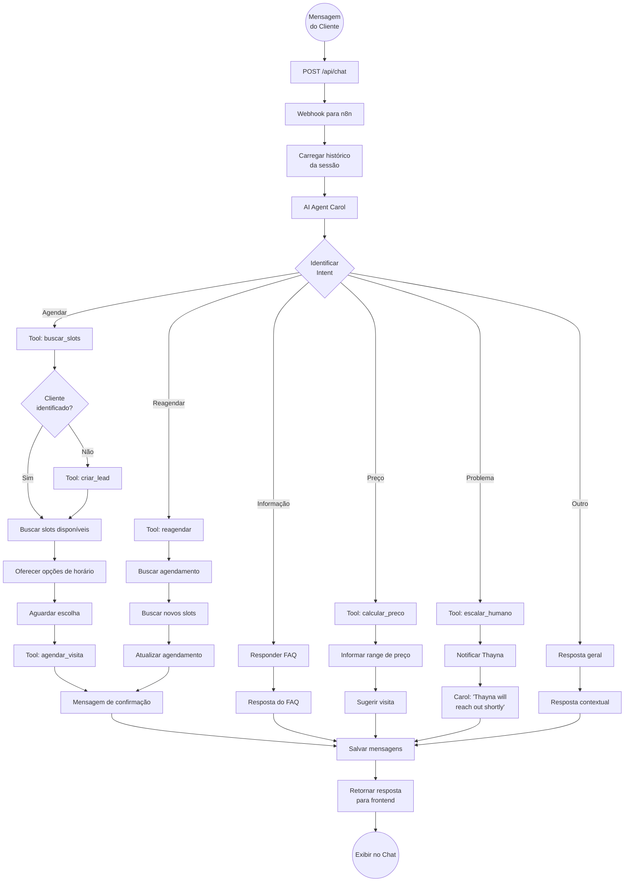

---

## 4. FLUXO DE AGENDAMENTO

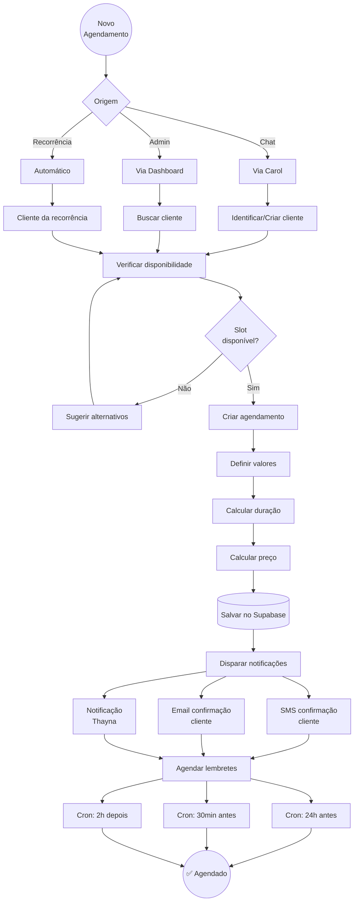

---

## 5. JORNADA DO CLIENTE RECORRENTE

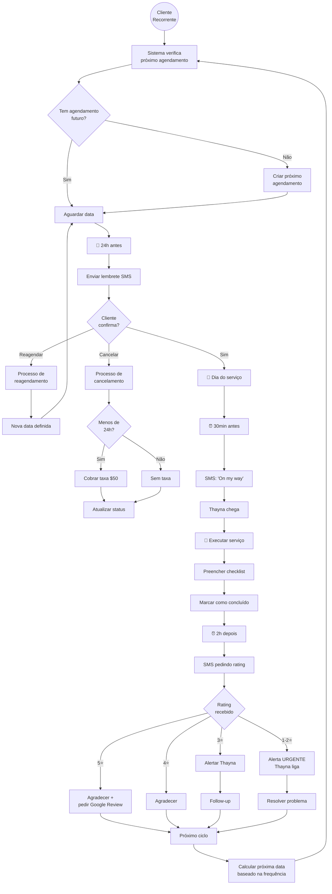

---

## 6. FLUXO DE NOTIFICAÇÕES

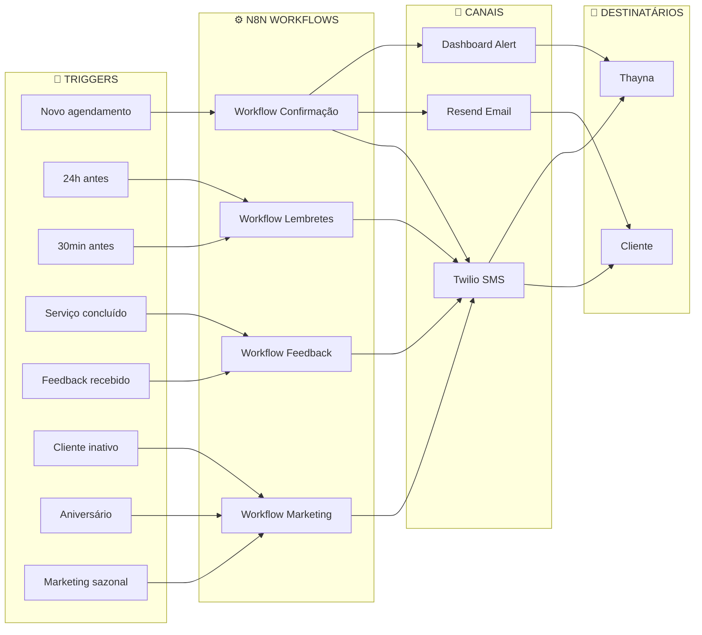

---

## 7. FLUXO FINANCEIRO

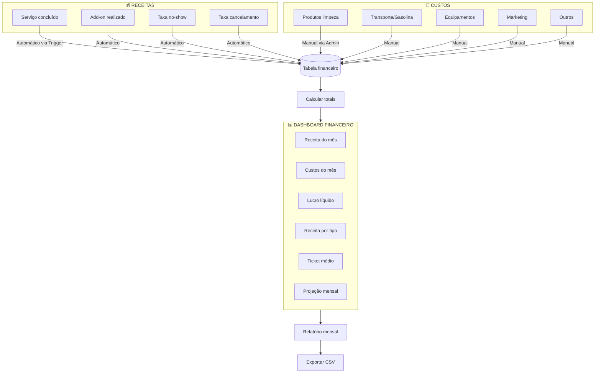

---

## 8. ESTADOS DO CLIENTE

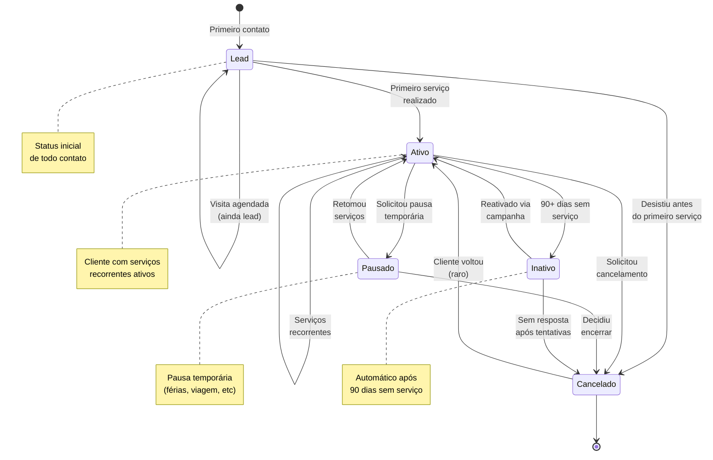

---

## 9. ESTADOS DO AGENDAMENTO

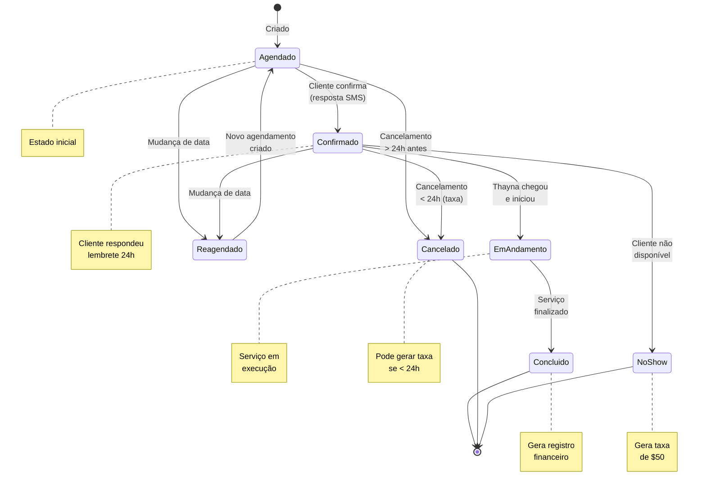

---

## 10. DIAGRAMA DE ENTIDADES (ER)

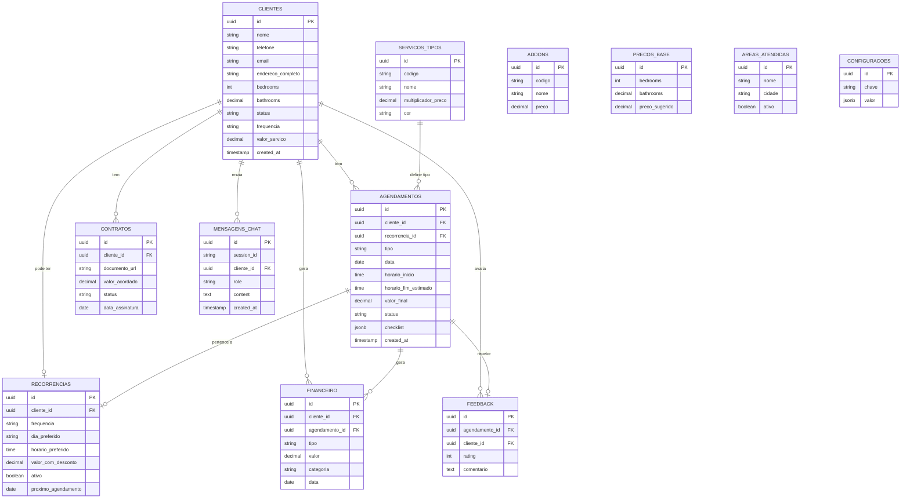

---

## 11. FLUXO DE NAVEGAÇÃO (FRONTEND)

```mermaid
flowchart TD
    subgraph Public["🌐 ROTAS PÚBLICAS"]
        HOME[/ Landing Page]
        CHAT_PAGE[/chat Chat Fullscreen]
        LOGIN[/login Login]
    end
    
    subgraph Admin["🔐 ROTAS ADMIN"]
        DASH[/admin Dashboard]
        AGENDA[/admin/agenda Calendário]
        CLIENTS[/admin/clientes Lista Clientes]
        CLIENT_DETAIL[/admin/clientes/id Ficha Cliente]
        CONTRACTS[/admin/contratos Contratos]
        FINANCIAL[/admin/financeiro Financeiro]
        SETTINGS[/admin/configuracoes Configurações]
    end
    
    HOME -->|CTA Chat| CHAT_WIDGET[Chat Widget]
    HOME -->|Link direto| CHAT_PAGE
    HOME -->|Footer link| LOGIN
    
    CHAT_WIDGET -->|Mobile| CHAT_PAGE
    
    LOGIN -->|Sucesso| DASH
    LOGIN -->|Falha| LOGIN
    
    DASH -->|Menu| AGENDA
    DASH -->|Menu| CLIENTS
    DASH -->|Menu| CONTRACTS
    DASH -->|Menu| FINANCIAL
    DASH -->|Menu| SETTINGS
    DASH -->|Quick action| CLIENTS
    DASH -->|Today card| AGENDA
    
    AGENDA -->|Click cliente| CLIENT_DETAIL
    AGENDA -->|Novo agendamento| MODAL_AGEND[Modal Agendamento]
    
    CLIENTS -->|Click row| CLIENT_DETAIL
    CLIENTS -->|Novo cliente| MODAL_CLIENT[Modal Cliente]
    
    CLIENT_DETAIL -->|Tab contratos| CONTRACTS
    CLIENT_DETAIL -->|Tab financeiro| FINANCIAL
    
    CONTRACTS -->|Novo contrato| MODAL_CONTRACT[Modal Contrato]
    
    FINANCIAL -->|Nova transação| MODAL_TRANS[Modal Transação]
    
    subgraph Modals["📦 MODAIS"]
        MODAL_AGEND
        MODAL_CLIENT
        MODAL_CONTRACT
        MODAL_TRANS
    end
```

---

## 12. FLUXO DE AUTENTICAÇÃO

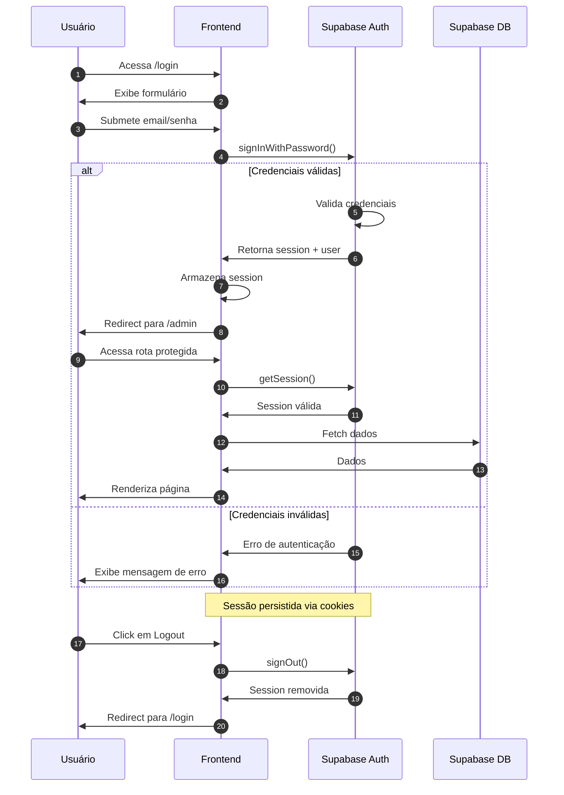

---

## 13. CAROL IA - AI AGENT TOOLS

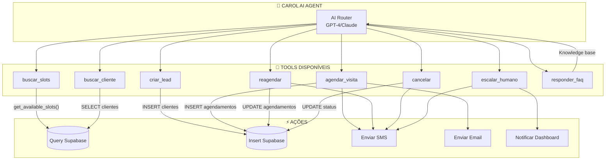

### Tool: buscar_slots

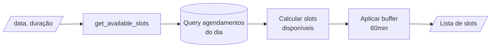

### Tool: criar_lead

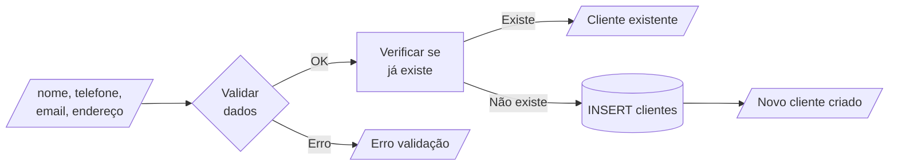

### Tool: agendar_visita

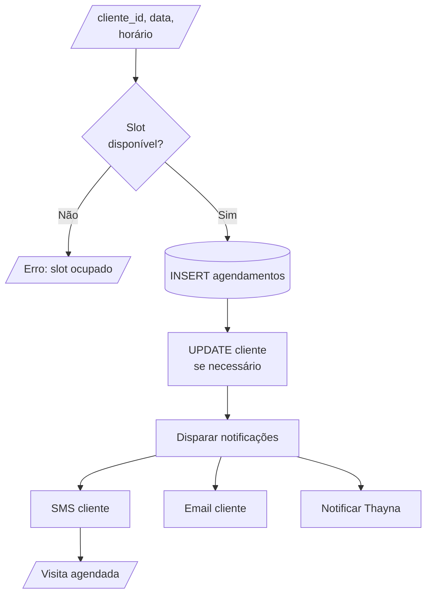

---

## 14. FLUXO DE RECORRÊNCIA

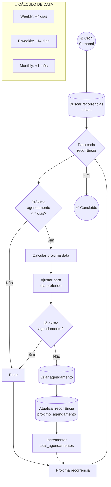

---

## 15. FLUXO DE FEEDBACK

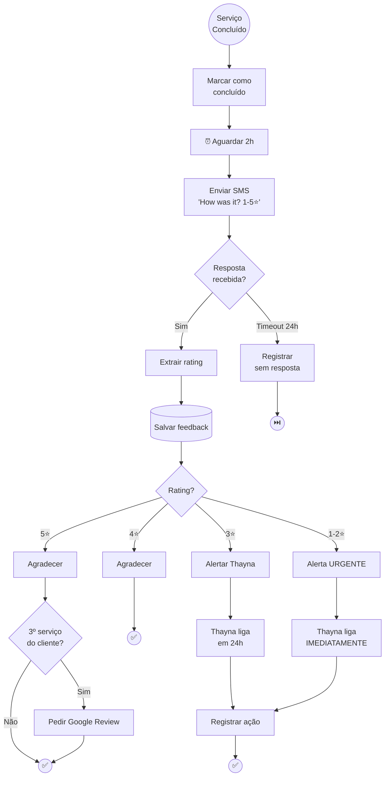

---

## LEGENDA

### Símbolos Mermaid

| Símbolo | Significado |
|---------|-------------|
| `[Retângulo]` | Processo/Ação |
| `{Losango}` | Decisão |
| `((Círculo))` | Início/Fim |
| `[(Cilindro)]` | Banco de dados |
| `[/Paralelo/]` | Input/Output |
| `-->` | Fluxo |
| `-->\|texto\|` | Fluxo com condição |

### Cores dos Serviços

| Cor | Tipo |
|-----|------|
| 🟢 Verde | Regular Cleaning |
| 🟡 Amarelo | Deep Cleaning |
| 🔵 Azul | Move-in/out |
| 🟣 Roxo | Office |
| 🟠 Laranja | Airbnb |
| ⚪ Cinza | Estimate Visit |
| 🔴 Vermelho | Cancelado |

---

**— FIM DOS FLOWCHARTS —**
